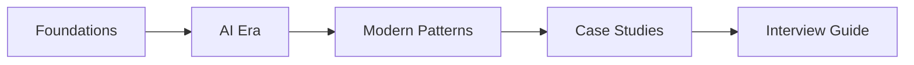

# system-design-bible
> System design for the AI era. The Primer updated, extended, and maintained.

    

### Why this repo
- **Beyond the Primer**: We add the AI infrastructure patterns that reached production after 2022.
- **Original Synthesis**: We write original explanations and diagrams instead of just aggregating links.
- **Reference Manual**: This is a free, open-source reference manual designed to be maintained indefinitely.

### Who this is for
This repository is for software engineers with 2+ years of experience who are preparing for system design interviews at L4–Staff level or building production systems using LLMs, agents, and vector databases.
**Not for**: Total beginners, ML researchers, or those seeking code tutorials.

### Structure Overview

### Table of Contents

#### Foundations
- [01-scalability.md](./foundations/01-scalability.md) — Vertical vs horizontal, predictive autoscaling.
- [02-reliability.md](./foundations/02-reliability.md) — SLOs, chaos engineering, and circuit breakers.
- [03-databases.md](./foundations/03-databases.md) — SQL, NoSQL, and NewSQL (Spanner/CockroachDB).
- [04-caching.md](./foundations/04-caching.md) — Distributed caches and semantic LLM caching.
- [05-networking-apis.md](./foundations/05-networking-apis.md) — gRPC, GraphQL, and SSE token streaming.
- [06-distributed-systems.md](./foundations/06-distributed-systems.md) — CAP theorem, Raft, and saga patterns.
- [16-security-by-design.md](./foundations/16-security-by-design.md) — Zero trust and AI-specific attack surfaces.

#### AI Era
- [07-llm-infrastructure.md](./ai-era/07-llm-infrastructure.md) — GPU memory, KV cache, and vLLM.
- [08-rag-systems.md](./ai-era/08-rag-systems.md) — Ingestion, hybrid search, and reranking.
- [09-agent-architecture.md](./ai-era/09-agent-architecture.md) — Multi-agent state machines and MCP.
- [10-vector-databases.md](./ai-era/10-vector-databases.md) — HNSW vs IVF, pgvector, and multi-tenancy.
- [11-llmops.md](./ai-era/11-llmops.md) — Tracing, prompt versioning, and AI observability.
- [12-ai-cost-at-scale.md](./ai-era/12-ai-cost-at-scale.md) — Token economics and model routing.

#### Modern Patterns
- [13-streaming-realtime.md](./modern/13-streaming-realtime.md) — Kafka, Flink, and real-time feature stores.
- [14-edge-computing.md](./modern/14-edge-computing.md) — Wasm isolates and edge inference.
- [15-platform-engineering.md](./modern/15-platform-engineering.md) — IDP design and golden paths.

#### Resources
- [Case Studies](./case-studies/) — 12 real company architectures.
- [Interview Guide](./interview-guide/50-questions.md) — 50 questions with worked answers.
- [Glossary.md](./GLOSSARY.md) — 80+ precise term definitions.

### What is new vs the Primer

| Topic | System Design Primer | System Design Bible |
|---|---|---|
| Latency Metrics | Uses 2012 Jeff Dean numbers | Uses 2026 NVMe and GPU HNSW numbers |
| LLM Serving | No coverage | vLLM, continuous batching, KV cache |
| RAG | No coverage | semantic chunking, hybrid search, reranking |
| AI Agents | No coverage | multi-agent sync, tool-calling reliability, MCP |
| Databases | SQL vs NoSQL split | NewSQL, Vector DBs, and sharding logic |
| Hardware | Magnetic disk focus | NVMe and H100 GPU memory focus |
| Streaming | Basic Kafka | Flink watermarks, SSE for LLM tokens |
| Edge | CDN static caching | Wasm isolates, edge inference, stateful edge |
| Transactions | 2PC and distributed locks | Saga patterns and transactional outbox |

> [!NOTE]
> ⭐ Star this repo to follow monthly updates as the field evolves.
> New patterns, case studies, and interview questions added every month.

### Contributing
Contributions are what make the open-source community an amazing place to learn, inspire, and create.
1. Add a production resource to an existing chapter.
2. Propose a new case study from a recent engineering blog.
3. Fix an outdated benchmark with a verified source.
See [CONTRIBUTING.md](./CONTRIBUTING.md) for details.
