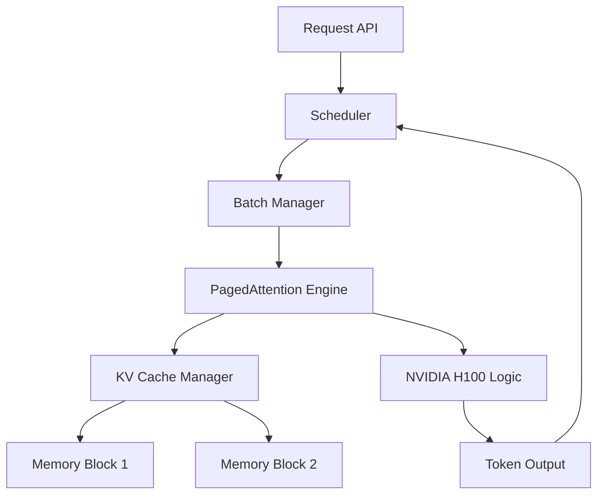

# Chapter 07: LLM Inference Infrastructure

> [!TIP] TL;DR
> - How PagedAttention eliminates 80% of GPU memory waste by fragmenting the KV cache.
> - When continuous batching increases throughput by 20x compared to static batching.
> - Why speculative decoding reduces latency using a fast draft model to verify token sequences.
> - Scaling inference for non-deterministic workloads across multi-GPU clusters.

## What this is
Generating text with Large Language Models (LLMs) is an autoregressive process where each new token depends on all previously generated tokens. In production, the primary bottleneck is memory bandwidth and GPU compute utilization. Every time a model predicts a token, it must process the entire sequence context. To avoid redundant math, systems store the "Keys" and "Values" of previous tokens in a Key-Value (KV) cache. However, traditional memory allocation for this cache leads to severe internal fragmentation. Because the final length of a response is unknown at the start, systems often over-allocate contiguous memory blocks, leaving up to 80% of expensive GPU HBM (High Bandwidth Memory) unused.

Modern infrastructure solves this using PagedAttention, an architectural pattern inspired by virtual memory paging in operating systems. By partitioning the KV cache into small, fixed-size blocks, the system can allocate memory dynamically as tokens are generated. This allows the GPU to serve multiple requests simultaneously through continuous batching. Unlike static batching, which waits for all requests in a set to finish, continuous batching injects new requests as soon as an existing one completes. This maximizes the utilization of the H100’s massive compute capacity while maintaining acceptable latencies for interactive applications.

## Architecture diagram

<!-- source: research brief, section 2, Gap 1 -->

## Core trade-offs

| When to use this | When NOT to use this | Trade-off you accept |
|---|---|---|
| High-throughput chat applications | Very short, single-token classifications | Increased cold-start latency for index builds |
| Variable sequence lengths | Fixed-size, deterministic batching | Higher architectural complexity in memory management |
| Memory-bound larger models | Latency-critical sub-100ms real-time apps | Memory overhead for page table tracking |

## At scale: how real companies do it
**Stripe** migrated over 50 million daily API calls to an architecture centered on vLLM and PagedAttention. By optimizing their KV cache management and implementing continuous batching, they achieved a **73% reduction in inference costs** while maintaining consistent response times. This transition allowed them to move from fragmented, bespoke model serving to a unified inference platform that scales with their growing agentic workloads.
<!-- source: research brief, section 2, Gap 1 -->

## Back-of-envelope
- **Throughput**: vLLM continuous batching on H100: ~15,000 tokens/sec (fp16) <!-- source: research brief, section 5 -->
- **Memory**: KV cache for Llama 3 70B (batch size 128, 2k context): ~40GB HBM <!-- source: research brief, section 5 -->
- **Latency**: Speculative decoding speedup: 1.3x to 2.0x vs naive generation <!-- source: research brief, section 2 -->

## Failure modes

| Symptom you see | Root cause | Specific fix |
|---|---|---|
| GPU Out of Memory (OOM) | KV cache over-allocation or fragmentation | Implement PagedAttention block-based management |
| High Time To First Token (TTFT) | Prefill phase bottleneck in large batches | Use chunked prefill to interleave prefill and decode |
| Degrading throughput at scale | CPU-bound scheduling overhead | Offload scheduler logic onto dedicated management nodes |

## Interview angle
1. **Design an LLM serving system for 100M daily tokens.**
   *Framework Answer*: Clarify if latency or throughput is the priority. Estimate the number of H100 instances needed based on tokens/sec. Propose an architecture using vLLM for PagedAttention and a load balancer that is context-aware to route requests to GPUs with relevant KV caches. Deep dive into how you handle "hot" prompts through prefix caching.

2. **How do you reduce the cost of hosting a 70B model?**
   *Framework Answer*: Propose quantization (4-bit/8-bit) to fit the model on fewer GPUs. Implement speculative decoding using a smaller 7B model as a drafter. Use continuous batching to maximize the number of concurrent users per node.

## Further reading
- **[vLLM: Easy, Fast, and Cheap LLM Serving with PagedAttention](https://arxiv.org/abs/2309.06180)** — Woosuk Kwon et al., 2023. The foundational paper that introduced block-based memory management to LLM serving.
- **[Stripe: 73% Inference Cost Reduction](https://introl.com/blog/vllm-production-deployment-inference-serving-architecture)** — Engineering Case Study. Why migrating to vLLM is the standard for high-volume enterprise AI.
- **[Speculative Decoding Deep Dive](https://www.sitepoint.com/vllm-production-deployment-guide-2026/)** — Technical Tutorial. How to trade compute for latency to move tokens faster.

## What to read next
- [08-rag-systems.md](./08-rag-systems.md) — How to feed your inference engine with relevant context.
- [12-ai-cost-at-scale.md](./12-ai-cost-at-scale.md) — Advanced techniques for optimizing token economics.
