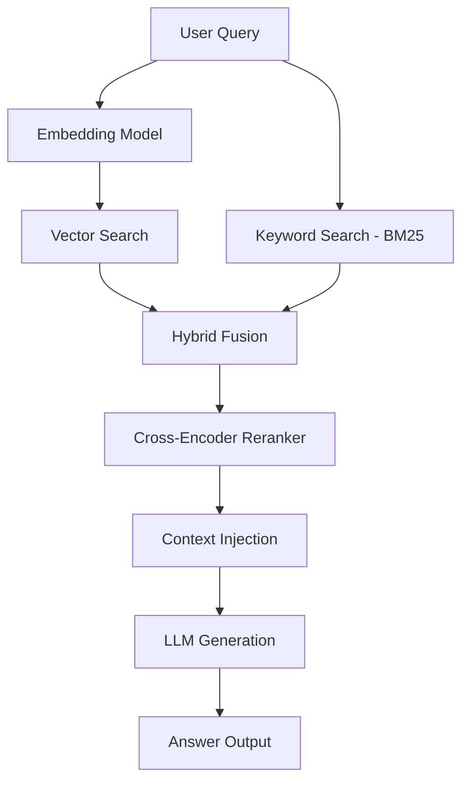

# Chapter 08: RAG Pipeline Architecture

> [!TIP] TL;DR
> - Why hybrid search (dense + sparse) is mandatory for production-grade retrieval.
> - How multi-stage reranking reduces noise and improves LLM context quality.
> - When to use semantic chunking over fixed-size windowing to preserve context.
> - Scaling RAG to 100 million documents with index freshness and multi-tenant isolation.

## What this is
Retrieval-Augmented Generation (RAG) is the dominant architectural pattern for providing LLMs with up-to-date, proprietary data without the cost of fine-tuning. A production RAG system functions as a controlled feedback loop: when a user asks a question, the system retrieves relevant document snippets from a data store and injects them into the LLM's context window. This grounds the model’s response in factual evidence, significantly reducing hallucinations. However, a naive "vector-only" approach often fails in production because it lacks the precision for keyword-heavy queries or specific entity matching.

An advanced RAG architecture employs a multi-stage retrieval pipeline. First, the ingestion engine processes raw documents through semantic chunking, which identifies natural boundaries in text (like paragraphs or sections) rather than cutting text at arbitrary character limits. These chunks are embedded into high-dimensional vectors and stored alongside a traditional inverted index. At query time, the system performs a hybrid search, combining dense vector similarity with sparse keyword matching (like BM25). The resulting candidate set is then passed through a cross-encoder reranker. This model re-evaluates the relationship between the query and each chunk more deeply than a vector search can, ensuring that only the most contextually relevant data reaches the LLM.

## Architecture diagram

<!-- source: research brief, section 2, Gap 2 -->

## Core trade-offs

| When to use this | When NOT to use this | Trade-off you accept |
|---|---|---|
| Proprietary or fast-changing data | Static knowledge already in the model | Additional 100-300ms retrieval latency |
| High-precision factual tasks | Creative writing or general reasoning | Higher infrastructure cost for vector storage |
| Large document corpuses | Small datasets that fit in context | Complexity of managing ingestion pipelines |

## At scale: how real companies do it
**Notion** manages a massive block-based data structure where permissions and context are deeply nested. To power their AI features, they implemented a RAG pipeline that handles billions of blocks. They use an architecture that separates transactional blocks from the analytical vector store, ensuring that a user’s search for "Q4 Budget" retrieves only from the pages they have access to. By using hybrid search and reranking, they provide a search experience that feels like it "understands" the workspace structure, rather than just matching words.
<!-- source: research brief, section 2, Gap 2 -->

## Back-of-envelope
- **Retrieval Latency**: HNSW ANN search at 1M vectors: <5ms p99 <!-- source: research brief, section 5 -->
- **Storage**: 1M chunks (1536-dim vectors) ≈ 6GB storage in pgvector <!-- source: research brief, section 5 -->
- **Index Freshness**: P95 time from document edit to searchable: <2 seconds <!-- source: research brief, section 2 -->

## Failure modes

| Symptom you see | Root cause | Specific fix |
|---|---|---|
| LLM Hallucinations | Irrelevant chunks provided as context | Implement cross-encoder reranking to filter noise |
| Stale search results | Ingestion pipeline lag or index lock | Use streaming ingestion with atomic index updates |
| High token costs | Chunks are too large for the context window | Use semantic chunking to reduce chunk size while keeping meaning |

## Interview angle
1. **Design a RAG system for an enterprise with 10M sensitive documents.**
   *Framework Answer*: Clarify the security requirements first. Propose a multi-tenant retrieval architecture where the vector search index includes metadata filters for user access control (RLS). Explain the ingestion pipeline: chunking, embedding, and hybrid search. Deep dive into how you ensure index freshness so users find their recently edited files.

2. **How do you improve the accuracy of a RAG system that is returning "garbage" results?**
   *Framework Answer*: Identify if the issue is in retrieval or generation. If retrieval, propose hybrid search (BM25 + Vector) to capture both semantics and keywords. Add a reranking step to prioritize the top 5 most relevant chunks. If generation, refine the prompt to instruct the model to only use the provided context.

## Further reading
- **[Hybrid Search: Density vs. Sparsity](https://www.firecrawl.dev/blog/best-vector-databases)** — Technical Analysis. Why combining vector search with BM25 wins in production.
- **[Notion: Scaling Data Lakes for AI](https://www.notion.com/blog/building-and-scaling-notions-data-lake)** — Engineering Blog. How Notion handles the scale of billions of blocks for AI retrieval.
- **[Reranking for RAG Accuracy](https://arxiv.org/html/2504.21030v1)** — Multi-Stage Retrieval Research. Documentation on why cross-encoders are the secret to preventing model confusion.

## What to read next
- [09-agent-architecture.md](./09-agent-architecture.md) — How to give your agents the ability to use RAG as a tool.
- [10-vector-databases.md](./10-vector-databases.md) — Deep dive into the storage engines powering RAG.
