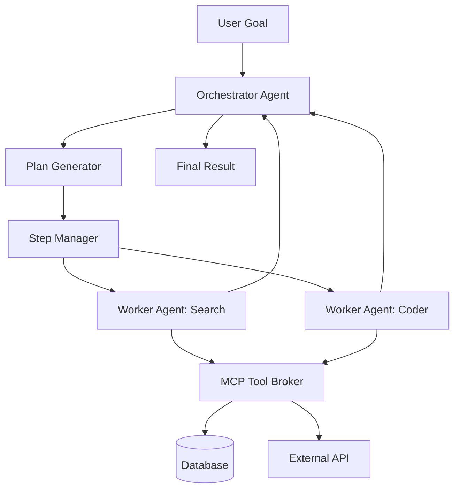

# Chapter 09: AI Agent Architecture

> [!TIP] TL;DR
> - How the Model Context Protocol (MCP) standardizes context sharing between agents and tools.
> - Why the orchestrator-worker pattern is the standard for managing non-deterministic workflows.
> - When to use Agent-to-Agent (A2A) protocols to reduce communication volume by 47%.
> - Designing for 10x token consumption overhead in multi-agent systems compared to standard chat.

## What this is
AI agents represent a shift from monolithic, single-prompt interactions to non-deterministic state machines. Unlike traditional software, which follows fixed branching logic, an agent uses an LLM to decide which actions (tools) to take based on a set of goals. Designing these systems at scale requires moving beyond simple loops to formal orchestration patterns. The core architectural challenge is reliability: ensuring that an agent doesn't enter an infinite loop, hallucinate tool parameters, or exceed its context window during complex tasks.

A production-grade agent architecture typically employs the orchestrator-worker pattern. A primary "orchestrator" agent receives the high-level objective and decomposes it into specialized sub-tasks. These tasks are then delegated to "worker" agents that operate within strict boundaries and have access to specific toolsets. To enable these agents to work across disparate data sources and tools, the industry has adopted the Model Context Protocol (MCP). This protocol provides a standardized mechanism for agents to discover and interact with tools, resolving the boundary issues that historically made agentic workflows fragile. By managing state centrally and using progressive disclosure of information, architects can build systems that achieve high task completion rates while controlling for cost and latency.

## Architecture diagram

<!-- source: research brief, section 2, Gap 3 -->

## Core trade-offs

| When to use this | When NOT to use this | Trade-off you accept |
|---|---|---|
| Open-ended, complex tasks | Deterministic, simple ETL jobs | 15x higher token consumption |
| Tasks requiring multiple tools | Single-step lookups | Significant increase in P99 latency |
| Research and coding workflows | Low-latency user interfaces | Non-deterministic failure modes |

## At scale: how real companies do it
**Anthropic** pioneered "Context Engineering" for agents, managing states across massive 200,000-token windows. They found that orchestrating specialized sub-agents is 15x more expensive in terms of token count but results in significantly higher reliability for complex coding tasks. Similarly, **Google** developed the Agent-to-Agent (A2A) protocol, which allows specialized models to communicate using a compressed, standardized broker. Empirical data shows that this protocol reduces the sheer volume of inter-model communication by 47%, allowing for faster iterations and lower costs in large-scale agent deployments.
<!-- source: research brief, section 2, Gap 3 -->

## Back-of-envelope
- **Efficiency**: A2A protocol reduces inter-agent communication volume by: 47% <!-- source: research brief, section 2 -->
- **Cost**: Orchestrated agent workflows consume up to: 15x more tokens than chatbots <!-- source: research brief, section 2 -->
- **Reliability Target**: Production goal for task completion: 99.9% <!-- source: research brief, section 2 -->

## Failure modes

| Symptom you see | Root cause | Specific fix |
|---|---|---|
| Infinite Agent Loops | Ambiguous goals or recursive tool calls | Implement a maximum step limit and deterministic exit conditions |
| Tool-calling Hallucinations | Model is confused by complex JSON schemas | Use the Model Context Protocol (MCP) to standardize tool definitions |
| Context Window Overflow | Agent history grows too large for the model | Implement a Sliding Window or Summary Buffer memory strategy |

## Interview angle
1. **Design an AI agent that can manage a professional calendar.**
   *Framework Answer*: Clarify the tools (Read Calendar, Write Calendar, Send Email). Propose an orchestrator-worker design where one agent plans the day and another executes the booking. Explain how you use MCP to connect the agent to the calendar API and how you handle conflicts through a deterministic "Human-in-the-Loop" step for high-risk edits.

2. **How do you ensure a multi-agent system doesn't cost $1,000 to solve a simple bug?**
   *Framework Answer*: Implement strict token quotas per task. Use a router to send easy sub-tasks to smaller, cheaper models (like Gemini Flash) and only use expensive models (like Claude Opus) for the final synthesis. Monitor for agent loops and cut off execution after a fixed number of steps.

## Further reading
- **[A2A Protocol: Mastering Agent-to-Agent Communication](https://medium.com/@genai_cybage_software/mastering-googles-a2a-protocol-the-complete-guide-to-agent-to-agent-communication-8d3ba985a10d)** — Google Engineering. The blueprint for reducing inter-model noise.
- **[Effective Context Engineering for AI Agents](https://www.anthropic.com/engineering/effective-context-engineering-for-ai-agents)** — Anthropic Research. Why managing prompt state is the new microservice orchestration.
- **[Model Context Protocol (MCP) Specification](https://arxiv.org/html/2504.21030v1)** — Open Standard. The official documentation on how to build interoperable tools and agents.

## What to read next
- [11-llmops.md](./11-llmops.md) — How to monitor and trace non-deterministic agentic workflows.
- [16-security-by-design.md](../foundations/16-security-by-design.md) — Understanding prompt injection and tool-auth risks in agents.
