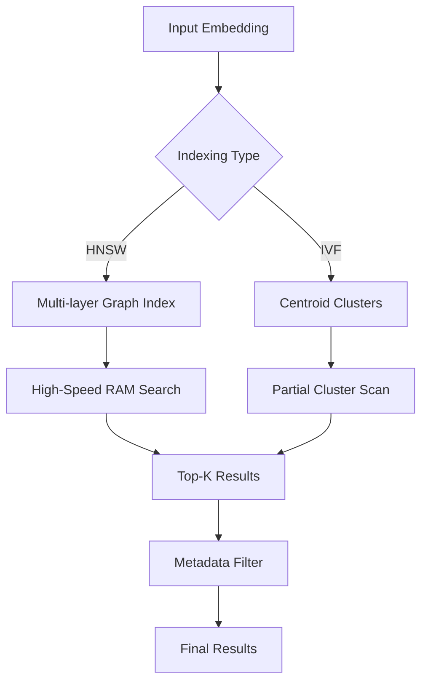

# Chapter 10: Vector Databases

> [!TIP] TL;DR
> - Why HNSW graphs prioritize recall and speed at the cost of massive RAM consumption.
> - How IVF indexing reduces memory overhead by clustering vectors into searchable buckets.
> - When to use PostgreSQL with pgvector versus dedicated distributed vector stores.
> - Scaling to 10 billion vectors with scalar filtering and multi-tenant isolation.

## What this is
Vector databases represent a new storage category designed for high-dimensional floating-point arrays (embeddings). Unlike traditional relational databases that use B-Trees for exact matching, vector databases utilize Approximate Nearest Neighbor (ANN) algorithms to find the most similar data points in a context where "similarity" is defined by mathematical distance (like Cosine Similarity or Euclidean distance). This is the foundation of modern retrieval systems used by LLMs. As datasets grow to millions or billions of vectors, the primary architectural challenge shifts from simple search to balancing recall accuracy, query latency, and memory costs.

The choice of indexing algorithm dictates the performance characteristics of the database. Hierarchical Navigable Small World (HNSW) graphs are the current production standard for high-performance applications. By building a multi-layered graph where the top layers enable "zooming" across the vector space and the bottom layers provide granular local search, HNSW achieves extreme speeds and 98%+ recall. However, this graph must reside entirely in memory, making it expensive for billion-scale datasets. Conversely, Inverted File (IVF) indexes cluster the vector space into buckets, reducing memory footprint by only searching the most relevant clusters at query time. Understanding these underlying mechanics is vital when choosing between augmenting an existing database (like PostgreSQL with pgvector) or deploying a specialized distributed engine.

## Architecture diagram

<!-- source: research brief, section 2, Gap 4 -->

## Core trade-offs

| When to use this | When NOT to use this | Trade-off you accept |
|---|---|---|
| Latency-critical apps (HNSW) | Cost-sensitive archival data | 10x-20x higher memory consumption |
| Accuracy > 98% (pgvector/HNSW) | Low-memory environments | Slow index build and update times |
| Unified data stacks (pgvector) | Sub-millisecond global search | Limited horizontal scaling compared to dedicated |

## At scale: how real companies do it
For teams that already manage PostgreSQL workloads, the paradigm has shifted thanks to **pgvectorscale**. Recent benchmark data demonstrates that by pairing PostgreSQL with specialized ANN extensions, organizations can achieve **28x lower p95 latency at 99% recall** compared to certain managed alternatives like Pinecone’s s1 pods. This allows developers to handle massive vector workloads—often up to billions of embeddings—without introducing a new, disparate stateful database to their infrastructure, radically simplifying the operational burden of production RAG systems.
<!-- source: research brief, section 2, Gap 4 -->

## Back-of-envelope
- **Query Latency**: ANN pgvectorscale Query (p95): < 5ms (at 99% recall) <!-- source: research brief, section 5 -->
- **Memory (HNSW)**: 1M vectors (1536-dim) ≈ 1.5GB to 2GB RAM for index <!-- source: research brief, section 2 -->
- **Recall Target**: Production standard for semantic search: 95% to 99% <!-- source: research brief, section 2 -->

## Failure modes

| Symptom you see | Root cause | Specific fix |
|---|---|---|
| Drastically falling recall | Index staleness; vector drift over time | Rebuild or re-cluster the index periodically |
| Memory saturation (OOM) | HNSW graph size exceeded available RAM | Use Product Quantization (PQ) to compress vectors or switch to IVF |
| High latency during writes | LSM-based index locking or compaction | Implement separate read and write replicas with async index syncing |

## Interview angle
1. **Design a vector search engine for a social media platform with 10B images.**
   *Framework Answer*: Clarify the recall requirements. Propose an IVF-based index (like IVF-PQ) to manage memory costs for 10B vectors. Explain the embedding pipeline and how scalar filtering (e.g., "only show images from the last 24 hours") is combined with vector similarity to avoid scanning the entire index.

2. **When would you choose pgvector over a dedicated database like Pinecone or Weaviate?**
   *Framework Answer*: Choose pgvector if the application already uses PostgreSQL and requires strong ACID guarantees and joint queries between vectors and relational metadata. Choose a dedicated database if the scale requires specialized features like automatic sharding, multi-region replication, or advanced multi-tenant isolation that are harder to configure in a standard Postgres setup.

## Further reading
- **[Pgvector vs. Pinecone: Performance and Cost Comparison](https://www.tigerdata.com/blog/pgvector-vs-pinecone)** — Tiger Data Blog. Why the "Postgres for everything" trend is winning in the vector space.
- **[HNSW vs IVF: A Complete Comparison Guide](https://www.firecrawl.dev/blog/best-vector-databases)** — Firecrawl. Detailed breakdown of the mathematical tradeoffs in ANN indexing.
- **[Scaling Vector Databases to 10 Billion Vectors](https://app.ailog.fr/en/blog/guides/vector-databases)** — Technical Architecture Guide. How to handle multi-tenancy and high-write volume in vector stores.

## What to read next
- [08-rag-systems.md](./08-rag-systems.md) — How vector databases power the retrieval stage of RAG.
- [03-databases.md](../foundations/03-databases.md) — Comparison with classic SQL and NoSQL storage engines.
