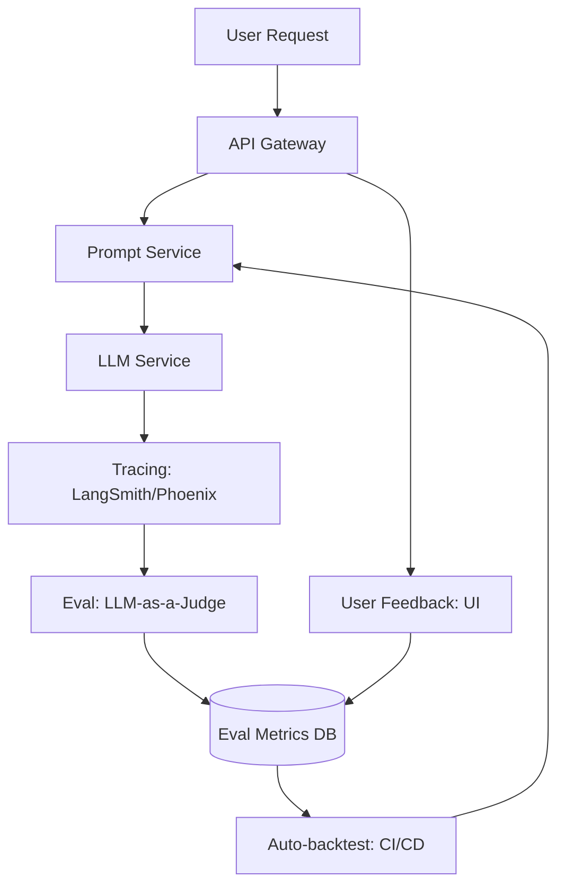

# Chapter 11: LLMOps & Observability

> [!TIP] TL;DR
> - Why traditional monitoring (CPU/RAM) fails for non-deterministic AI systems.
> - Implementing "LLM-as-a-Judge" to automate the evaluation of model quality at scale.
> - Using distributed tracing (traces, spans) to debug multi-step RAG and Agentic flows.
> - Managing model drift with continuous evaluation loops and automated backtesting.

## What this is
LLMOps (Large Language Model Operations) is the set of practices and tools used to deploy, monitor, and maintain LLMs and AI agents in production. Unlike traditional software, where a specific input predictably produces a specific output, LLMs are non-deterministic. A system might be "online" and returning 200 OK responses, but if the content of those responses is factually incorrect or toxic, the system has failed. This shift requires a move from infrastructure monitoring to **Quality Observability**.

Production-grade LLMOps focuses on three pillars: **Tracing, Evaluation, and Feedback**. **Tracing** involves capturing the entire "life of a request," through the embedding model, vector database, and final LLM call, allowing engineers to identify exactly where a RAG pipeline failed. **Evaluation** moves beyond simple benchmarks to "LLM-as-a-Judge," where a more powerful model (like GPT-4o) evaluates the responses of a smaller production model (like Gemini Flash) against a set of rubrics. Finally, **Feedback Loops** capture user interactions (like "thumbs up/down") and feed them back into the evaluation dataset, ensuring that the system continuously improves based on real-world usage.

## Architecture diagram

<!-- source: research brief, section 3, Topic: LLMOps -->

## Core trade-offs

| When to use this (Full Observability) | When NOT to use this | Trade-off you accept |
|---|---|---|
| Customer-facing, critical AI apps | Internal tools with low risk | Significant token cost for "Judge" models |
| Multi-step RAG or Agentic flows | Single-shot, simple text summaries | Latency for capturing and storing traces |
| High-compliance environments | Rapid, early-stage prototyping | Operational complexity of eval pipelines |

## At scale: how real companies do it
**Stripe** manages the quality of their support chatbot by running every significant response through an automated evaluation suite. They utilize an "Evaluation-in-the-Loop" architecture: when a developer changes a prompt or a model version, the CI/CD pipeline automatically runs the new system against a dataset of 1,000+ representative user queries. A "Model Judge" scores the new responses for accuracy and safety. Only if the new version outperforms the "Gold Standard" baseline is it promoted to production, demonstrating that for AI, testing is an ongoing, analytical process, not just a binary "pass/fail."
<!-- source: research brief, section 4, Case Study 5 -->

## Back-of-envelope
- **Cost**: Eval tokens can consume up to: 10% - 20% of total inference spend <!-- source: research brief, section 3 -->
- **Reliability**: P99 Trace capture latency: < 50ms (async) <!-- source: research brief, section 2 -->
- **Effectiveness**: Human-Model Judge correlation: ~85% - 95% for simple rubrics <!-- source: research brief, section 3 -->

## Failure modes

| Symptom you see | Root cause | Specific fix |
|---|---|---|
| Model Drift | The production model's quality falls over time | Implement continuous evaluation against a static "Gold Standard" test set |
| Trace Overflow | Capturing 100% of traces is too expensive/slow | Use probabilistic sampling (e.g., 5% of traces) for high-volume apps |
| "Judge" Hallucinations | The LLM-as-a-Judge is wrong or biased | Use diversified judges (multi-model) and periodic human audit |

## Interview angle
1. **How do you know if your RAG system is actually improving after a prompt change?**
   *Framework Answer*: Propose a formal **A/B evaluation framework**. Create a "test set" of query-answer pairs. Use an "LLM-as-a-Judge" to score the old and new system outputs based on three metrics: Faithfulness (is the answer in the context?), Answer Relevance, and Context Precision. If the new system's average score is statistically higher, the change is a success.

2. **How do you debug an AI agent that is taking 60 seconds to answer a simple question?**
   *Framework Answer*: Use **Distributed Tracing**. Look at the "Spans" within the request trace to see if the delay is in the vector database search, the model's "thinking" phase, or a slow external tool call. Identify if the agent is entering a "loop" by checking for repeated similar traces. Propose a timeout or a step-limit if a certain span exceeds 5 seconds.

## Further reading
- **[LangSmith: Observability for LLMs](https://docs.smith.langchain.com/)** — Comprehensive guide to tracing and testing non-deterministic apps.
- **[Arize Phoenix: Evaluation in Production](https://docs.arize.com/phoenix/)** — Open-source framework for LLM-as-a-judge and trace analysis.
- **[The RAG Triad: Evaluating Retrieval Accuracy](https://www.trulens.org/trulens_eval/core_concepts_rag_triad/)** — Technical Deep Dive. How to measure retrieval vs. generation quality.

## What to read next
- [07-llm-infrastructure.md](../ai-era/07-llm-infrastructure.md) — How the infrastructure layer generates the logs you monitor.
- [09-agent-architecture.md](./09-agent-architecture.md) — Why multi-step agents make tracing mandatory.
