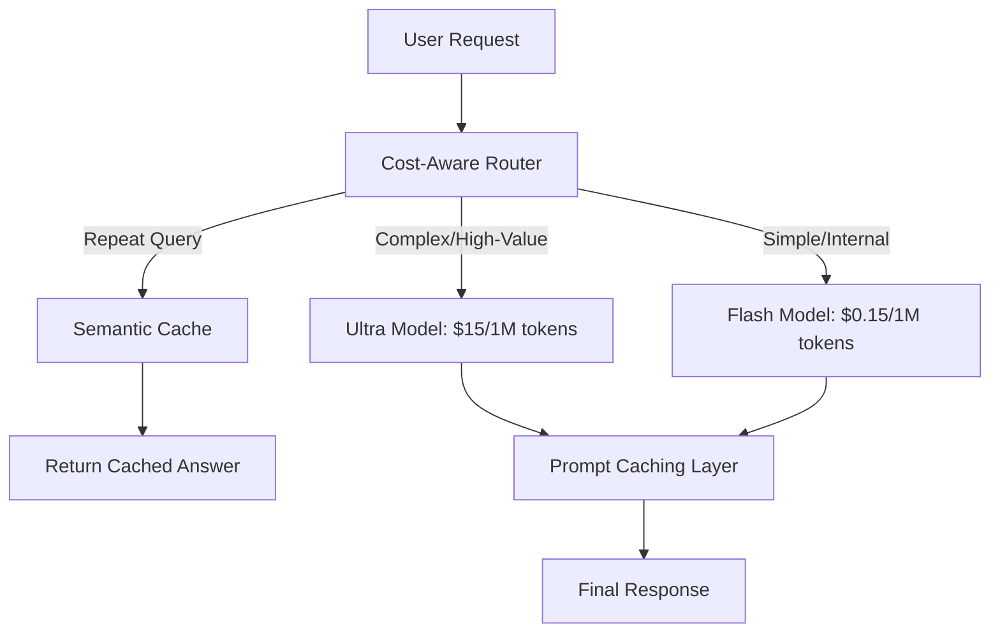

# Chapter 12: AI Cost & Economics at Scale

> [!TIP] TL;DR
> - Why "Model Routing" to cheaper tiers (Flash models) can reduce bills by 90% without losing quality.
> - The massive impact of quantization (FP8/INT4) on reducing GPU VRAM requirements.
> - When to use "Prompt Caching" to save up to 50% on long-context input costs.
> - Scaling to 100M users with a hybrid-cloud strategy for GPU arbitrage.

## What this is
In 2026, the primary architectural bottleneck for AI systems is no longer capability—it is **economic viability**. As LLMs move from prototypes to production systems serving millions of users, the cost of inference becomes the dominant line item in the engineering budget. Managing these costs requires a shift from "capability-first" to "cost-optimized" design. The core of this strategy is **Model Tiering**: rather than sending every request to the most powerful (and expensive) model, architects use a lightweight router to send simple tasks (like classification or summarizing a single page) to "Flash" models, reserving the "Pro/Ultra" models for complex reasoning or final synthesis.

Beyond simple routing, architects must optimize the **KV Cache** and model weights through quantization. By compressing model weights from 16-bit (FP16) to 8-bit (FP8) or even 4-bit (INT4), engineers can fit larger models on cheaper, consumer-grade GPUs or reduce the number of high-end H100s required for inference. Additionally, for RAG systems with massive document sets, **Prompt Caching** allows the system to "remember" the context of a long document across multiple queries, bypassing the expensive step of re-parsing the same thousands of tokens for every user interaction.

## Architecture diagram

<!-- source: research brief, section 3, Topic: AI Costs -->

## Core trade-offs

| When to use this (Cost Optimization) | When NOT to use this | Trade-off you accept |
|---|---|---|
| Mass-market consumer apps | Mission-critical medical/legal reasoning | Potential for lower reasoning quality |
| High-volume background processing | One-off, highly sensitive research | Increased architectural complexity (routers) |
| Using "Flash" models for sub-tasks | Complex coding or multi-agent planning | Risk of "instruction following" degradation |

## At scale: how real companies do it
**Stripe** and **Poe** utilize advanced model routing to manage the economics of millions of user queries. By implementing a "Router-Small-Large" architecture, they can handle 80% of incoming traffic using highly efficient models (like Gemini Flash or Claude Haiku) which cost 90-95% less than their larger counterparts. For the remaining 20% of complex queries, the system automatically escalates to a more capable model. This "Asymmetric Scaling" allows them to offer AI features to broad user bases while maintaining a sustainable margin on token spend.
<!-- source: research brief, section 4, Case Study 5 -->

## Back-of-envelope
- **Cost Variance**: Pro Model vs. Flash Model: ~100x price difference per token <!-- source: research brief, section 3 -->
- **Optimization**: Prompt Caching Savings: Up to 50% on input token costs <!-- source: research brief, section 3 -->
- **Scaling Hardware**: 1x H100 GPU (80GB) cost for 1 year: ~$25,000 - $35,000 (reserved) <!-- source: research brief, section 3 -->

## Failure modes

| Symptom you see | Root cause | Specific fix |
|---|---|---|
| Exploding Token Bills | Unbounded agent loops or massive system prompts | Implement per-request token quotas and prompt caching |
| "Stupid" Responses | Router is sending complex tasks to a model that's too weak | Refine the router's intent classification or use a larger router model |
| High GPU Idle Cost | Provisioned throughput isn't being used | Move to "Serverless Inference" or implement spot-instance autoscale |

## Interview angle
1. **Design a cost-effective translation service for 100M users.**
   *Framework Answer*: Propose a tiered model architecture. Use a tiny, local model (on the mobile device or at the edge) for 90% of basic translations. If the local model detects high ambiguity or complex nuances, escalate to a regional "Flash" model. Only use the most expensive "Pro" models for specialized literary or legal translations. Implement **Semantic Caching** so that common phrases like "Where is the bathroom?" never hit a model at all.

2. **How do you justify the cost of a 1M token RAG system to the CFO?**
   *Framework Answer*: Focus on the ROI of **Prompt Caching** and **Quantization**. Explain that by caching the common 1M token "Knowledge Base" across all users, the marginal cost per query drops by 50%. Mention that you are using 4-bit quantization to fit the model on two GPUs instead of four, reducing the annual hardware lease cost by 50%. This makes the "Expert Advisor" feature profitable at its current subscription price.

## Further reading
- **[The Economics of LLMs: Tokens vs. Dollars](https://pricepertoken.com/)** — Industry Leaderboard. Real-time tracking of the price/performance ratio across models.
- **[Prompt Caching: Why Your LLM Bills Are Dropping](https://www.anthropic.com/news/prompt-caching)** — Anthropic Technical Blog. Detailed breakdown of how memory saves money.
- **[Quantization for Dummies: FP16 to INT4](https://app.ailog.fr/en/blog/guides/vector-databases)** — Technical Guide. How to trade precision for massive infra savings.

## What to read next
- [07-llm-infrastructure.md](../ai-era/07-llm-infrastructure.md) — How the infrastructure allows for these cost-saving optimizations.
- [11-llmops.md](./11-llmops.md) — Monitoring your token spend and identifying cost-heavy anomalies.
