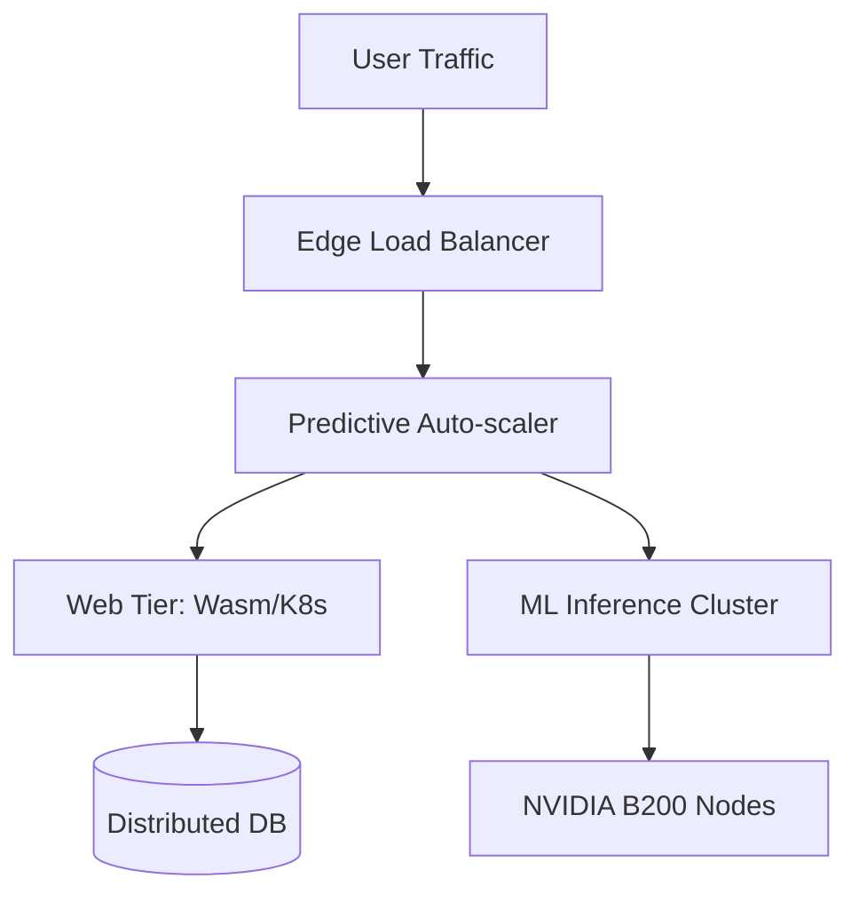

# Chapter 01: Scalability & Performance

> [!TIP] TL;DR
> - Why predictive autoscaling using ML beats reactive threshold-based scaling for bursty workloads.
> - The 2026 hardware threshold: When vertical scaling on 448-core instances is cheaper than horizontal sharding.
> - Scaling for non-deterministic AI workloads with asymmetric input/output costs.
> - Load balancing at the edge using Wasm isolates to minimize Time To First Token (TTFT).

## What this is
Scalability is the ability of a system to handle increasing load by adding resources, while performance measures how effectively those resources are utilized (latency vs throughput). In the Web 2.0 era, scaling focused on horizontal replication of stateless web tiers and simple database sharding. In 2026, the paradigm has shifted. Vertical scaling is no longer a "quick fix" but a viable long-term strategy, as cloud providers now offer instances with over 400 virtual cores and terabytes of RAM, often delaying the need for the architectural complexity of distributed state.

Modern scaling is also increasingly **predictive**. Rather than waiting for CPU usage to hit 80% (reactive scaling), systems use machine learning models to anticipate traffic surges based on historical patterns, pre-provisioning capacity minutes before a "flash sale" or "AI viral moment" occurs. Furthermore, architectural performance is now dominated by the **NVMe bottleneck shift**: because disk f-sync operations now complete in under 1ms, systems that were once IO-bound are now almost exclusively CPU-bound (processing requests) or network-bound (shuffling data). Scaling a system in the AI era requires a deep understanding of these physical hardware shifts and the economic asymmetry of new workloads.

## Architecture diagram

<!-- source: research brief, section 3, Topic: Scalability -->

## Core trade-offs

| When to use this (Horizontal) | When NOT to use this | Trade-off you accept |
|---|---|---|
| Massive, globally distributed load | Single-region, high-consistency tasks | Network overhead and eventual consistency |
| Fault tolerance through redundancy | Simple CRUD with low concurrent users | Operational complexity (orchestration) |
| Non-deterministic AI inference | CPU-light background jobs | Higher inter-service latency |

## At scale: how real companies do it
**AWS** and **Google Cloud** have transitioned their internal scaling engines from reactive thresholds to machine-learning-driven predictive models. By analyzing years of seasonal traffic data, these platforms can pre-warm thousands of nodes across multiple Availability Zones, ensuring that applications like Netflix or Shopify don't experience "cold start" latency spikes during global events. This demonstrated that at the Scale of the Internet, reactivity is a form of technical debt.
<!-- source: research brief, section 3 -->

## Back-of-envelope
- **Hardware Scale**: 2026 High-Memory Cloud Instance: 448 vCPUs / 12TB RAM <!-- source: research brief, section 3 -->
- **Storage Speed**: NVMe fsync latency: 0.05ms - 1.0ms (vs 10ms for 2012 HDD) <!-- source: research brief, section 5 -->
- **Cloud Cost**: Network Egress (Cross-Region): ~$0.09 - $0.12 / GB <!-- source: research brief, section 5 -->

## Failure modes

| Symptom you see | Root cause | Specific fix |
|---|---|---|
| Scaling Lag | Reactive scaling rules trigger too late | Implement predictive autoscaling based on traffic velocity |
| Resource Hotspotting | Poor consistent hashing or sharding key choice | Use virtual nodes and analyze shard distribution metrics |
| Performance Floor | Reached physical CPU/Network limits on a single node | Transition from vertical to horizontal scaling or optimize hot-path code |

## Interview angle
1. **Design a system to handle the checkout for a flash sale with 10M concurrent users.**
   *Framework Answer*: Clarify the bottleneck (likely the transactional database). Propose a multi-tier scaling strategy: use scriptable edge load balancers to queue requests in memory, push web tiers into predictive autoscaling groups, and use a distributed cache (Redis) for inventory lookups. Deep dive into the "Transactional Outbox" pattern to ensure consistency without locking the DB.

2. **When should you scale vertically versus horizontally?**
   *Framework Answer*: Scale vertically (upgrading the node) when you need low-latency, high-consistency processing and the load fits within a single powerful instance (e.g., 400+ cores). Scale horizontally (adding nodes) for massive throughput, global distribution, and fault tolerance where no single node could handle the failure risk or total volume.

## Further reading
- **[AWS Predictive Auto Scaling Architecture](https://docs.aws.amazon.com/autoscaling/ec2/userguide/as-using-predictive-scaling.html)** — Official Guide. How to trade historical data for zero-latency capacity surges.
- **[The Path to 10M Events/Sec](https://dev.to/david_kjerrumgaard_d31d7e/latency-numbers-every-data-streaming-engineer-should-know-h91)** — Streaming Benchmarks. Why NVMe has changed everything for high-throughput architects.
- **[ScyllaDB: Real-time Mutations at Scale](https://discord.com/blog/how-discord-stores-trillions-of-messages)** — Discord Case Study. Modern horizontal scaling using virtual nodes to prevent hotspots.

## What to read next
- [02-reliability.md](./02-reliability.md) — How to stay online while you scale.
- [07-llm-infrastructure.md](../ai-era/07-llm-infrastructure.md) — Special considerations for scaling GPU-bound workloads.
