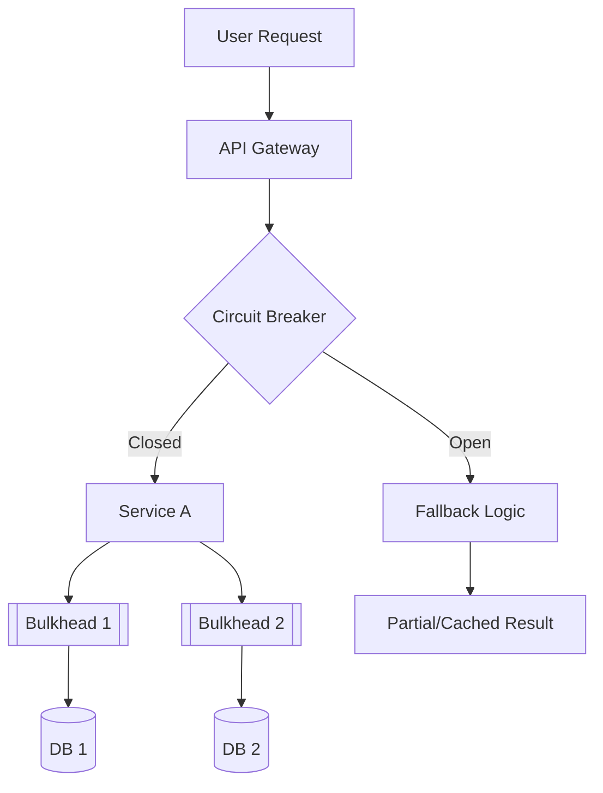

# Chapter 02: Reliability & Fault Tolerance

> [!TIP] TL;DR
> - Why SLOs (Service Level Objectives) are the only metric that matters for business reliability.
> - Using circuit breakers and bulkheads to prevent cascading system failures.
> - How chaos engineering proactively identifies "unknown unknowns" in distributed state.
> - Designing for graceful degradation: when to return a partial answer instead of a 500 error.

## What this is
Reliability is the probability that a system will perform its intended function under specified conditions for a specified period. In 2026, we accept that **failure is inevitable** in distributed systems. Instead of trying to build "invincible" hardware, we design software architectures that are resilient—able to detect, isolate, and recover from failures with minimal user impact. This shift is codified in the SRE (Site Reliability Engineering) practice, which replaces vague "uptime" goals with precise Service Level Objectives (SLOs) tied to the user experience (e.g., "99.9% of user requests must complete in under 200ms").

To achieve these SLOs, architects deploy structural patterns that limit the "blast radius" of any single component failure. **Circuit Breakers** monitor for high error rates from a downstream service and "trip," instantly failing fast to prevent the upstream service from hanging. **Bulkheads** isolate resources (like thread pools or DB connections) so that a failure in one feature area (e.g., "User Recommendations") cannot consume all resources and crash an unrelated feature (e.g., "Checkout"). Finally, **Chaos Engineering** moves reliability from a reactive to a proactive discipline, intentionally injecting failures into production to verify that these resilience patterns actually work under stress.

## Architecture diagram

<!-- source: research brief, section 3, Topic: Reliability -->

## Core trade-offs

| When to use this | When NOT to use this | Trade-off you accept |
|---|---|---|
| Distributed microservices | Monolithic, low-traffic apps | Significant increase in code complexity |
| Latency-sensitive critical paths | Background, non-critical tasks | Resource overhead for health checks/monitoring |
| Systems requiring 99.9%+ uptime | Prototyping and early-stage MVPs | Potential for stale data during fallback |

## At scale: how real companies do it
**Stripe** maintains extreme payment reliability by treating every dependency as a potential failure point. They utilize the "Transactional Outbox" pattern to ensure that even if the primary database or downstream bank API fails, the record of the transaction is persisted locally and retried asynchronously. This ensures that a user never sees a "Payment Stalled" screen, even if a global network partition occurs. Stripe's engineering culture prioritizes the SLO of "successful payment intent" above all other technical metrics.
<!-- source: research brief, section 4, Case Study 5 -->

## Back-of-envelope
- **SLA Availability**: "Three Nines" (99.9%): ~8.77 hours of downtime/year <!-- source: research brief, section 3 -->
- **SLA Availability**: "Four Nines" (99.99%): ~52.56 minutes of downtime/year <!-- source: research brief, section 3 -->
- **Recovery Time**: p95 Circuit Breaker reset time: < 30 seconds after health recovers <!-- source: research brief, section 2 -->

## Failure modes

| Symptom you see | Root cause | Specific fix |
|---|---|---|
| Cascading Failure | One service's latency causes upstream services to time out | Implement circuit breakers and strict request timeouts |
| Resource Exhaustion | A single endpoint consumes all DB connections | Implement bulkheads per service or per feature area |
| Split-Brain Failure | Network partition leads to conflicting state updates | Use a consensus algorithm (Raft) or a leader-based DB (Spanner) |

## Interview angle
1. **Design a notification system that stays reliable during a massive traffic spike.**
   *Framework Answer*: Clarify if duplicate notifications are acceptable (At-least-once). Propose a producer-consumer architecture using a message queue (Kafka) to buffer spikes. Implement a circuit breaker on the downstream push-notification service to avoid overloading it. Deep dive into the retry logic with exponential backoff and jitter to prevent "thundering herd" issues.

2. **What is the difference between an SLA, an SLO, and an SLI?**
   *Framework Answer*: An **SLI** (Indicator) is what you measure (e.g., latency). An **SLO** (Objective) is the target value for that indicator (e.g., <200ms). An **SLA** (Agreement) is the contract with the user about what happens if the SLO isn't met (e.g., financial credits). Reliability engineering is about hitting SLOs so you never trigger the SLA penalties.

## Further reading
- **[Google SRE Book: Embracing Risk](https://sre.google/sre-book/embracing-risk/)** — The foundational text on why 100% uptime is the wrong target.
- **[Stripe: Building Reliability with Transactional Outboxes](https://stripe.com/blog/how-we-built-it-real-time-analytics-for-stripe-billing)** — Engineering Blog. How to handle state consistent when everything else is failing.
- **[Chaos Engineering at Netflix](https://research.netflix.com/research-area/recommendations)** — Case Study. How "Simian Army" proved that resiliency must be tested in production.

## What to read next
- [01-scalability.md](./01-scalability.md) — How scaling introduces new reliability risks.
- [06-distributed-systems.md](./06-distributed-systems.md) — The mathematical foundations of consensus and partition handling.
