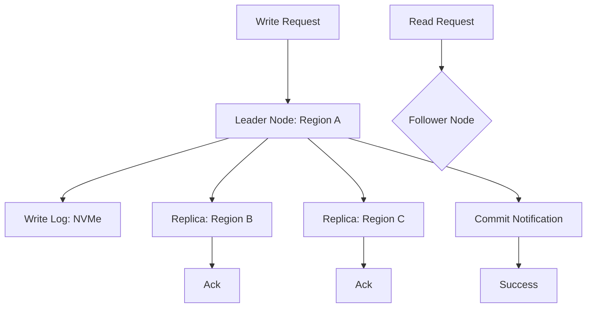

# Chapter 03: Databases & Storage

> [!TIP] TL;DR
> - Why NewSQL systems like Spanner deliver horizontal scale with ACID guarantees.
> - The tradeoff between leader-based and leaderless replication for global consistency.
> - When to shard a transactional database and how to handle the resharding problem.
> - Why NVMe storage has shifted database design from disk-IO-bound to CPU-bound.

## What this is
Databases are the stateful foundations of every system. For decades, the choice was binary: Relational (SQL) for strict consistency and complex queries, or NoSQL for horizontal scale and flexible schemas. In 2026, this dichotomy has dissolved. The rise of **NewSQL**—exemplified by Google Spanner and CockroachDB—has proven that you can have ACID-compliant transactional consistency across a globally distributed cluster. These systems use advanced techniques like Optimistic Concurrency Control (OCC) and TrueTime (atomic clocks) to manage distributed state without the massive performance penalty of classic two-phase locking.

Furthermore, the physical hardware underlying these databases has undergone a generational shift. Traditional databases were optimized for the high seeking latency of magnetic disks (HDDs). Modern NVMe SSDs have reduced random-read latencies from 10ms to under 16 microseconds (16,000ns). This means that for the first time in history, the primary bottleneck in most data storage systems is no longer the disk; it is the CPU (processing the SQL/JSON) or the network (replicating data across regions). Scaling a database now requires focused attention on data locality—keeping the data mere milliseconds from the user—and choosing the right replication topology to balance global latency against the CAP theorem’s consistency constraints.

## Architecture diagram

<!-- source: research brief, section 3, Topic: Databases -->

## Core trade-offs

| When to use this (SQL/NewSQL) | When NOT to use this | Trade-off you accept |
|---|---|---|
| Financial/Transactional data | High-throughput sensor data (WORM) | Slower write latency due to consensus |
| Complex relational queries | Simple key-value lookups at 1M+ RPS | Operational cost of managing schema |
| Global ACID consistency | High-availability "Always On" (AP) | Complexity of distributed transactions |

## At scale: how real companies do it
**Notion** faced a catastrophic scaling wall as their core Postgres database reached hundreds of billions of nested blocks. To survive, they manually sharded their database into 480 logical shards across 96 physical instances. While this allowed them to continue scaling horizontally, it introduced significant complexity in query routing. Simultaneously, they moved their analytical workloads to an S3-backed snowflake data lake, illustrating the modern "Transactional/Analytical Split": use your primary DB for small, fast writes and your data lake for long-form research.
<!-- source: research brief, section 4, Case Study 6 -->

## Back-of-envelope
- **Storage Latency**: SSD Random Read: 16 microseconds (16,000 ns) <!-- source: research brief, section 5 -->
- **Storage Latency**: HDD Random Read (2012 Legacy): ~10,000,000 ns <!-- source: research brief, section 5 -->
- **Replication**: Same-AZ Round Trip (p99): 0.2ms - 1.0ms <!-- source: research brief, section 5 -->

## Failure modes

| Symptom you see | Root cause | Specific fix |
|---|---|---|
| Write Stall | Distributed consensus failure (no quorum) | Implement leader election or reduce sync-replica count |
| Hot Partitions | Geographic concentration or poor sharding key | Use a hash-based sharding key or implement virtual shards |
| Stale Reads | Reading from a follower before replication completes | Use "Bounded Staleness" or route read-your-writes to leader |

## Interview angle
1. **Design a global bank database that never loses a transaction.**
   *Framework Answer*: Clarify the requirement: strict external consistency is mandatory. Propose a NewSQL architecture like Google Spanner. Explain how it uses a leader-follower replication topology across three regions to achieve a quorum. Deep dive into how TrueTime (atomic clocks) allows the system to order transactions globally without a central bottleneck.

2. **How do you handle sharding for a database that is growing by 1TB per day?**
   *Framework Answer*: Propose a range-based or hash-based sharding strategy. Explain the need for a dedicated "Coordinate/Router" layer that directs client requests to the correct shard. Deep dive into the resharding problem: how you split an existing shard into two while the system is still taking writes (the "Live Migration" pattern).

## Further reading
- **[Google Spanner: Optimistic Concurrency Control](https://docs.cloud.google.com/spanner/docs/release-notes)** — 2026 Technical Recap. How the world’s most advanced DB moved away from global locks.
- **[Notion: Sharding Postgres for 100M+ Users](https://www.notion.com/blog/building-and-scaling-notions-data-lake)** — Engineering Blog. A deep dive into the pain and pleasure of horizontal sharding.
- **[ACID vs BASE: The Modern Reality](https://cloud.google.com/blog/products/databases/spanner-in-2025)** — Whitepaper. Why the CAP theorem is no longer a strict binary in cloud-native systems.

## What to read next
- [04-caching.md](./04-caching.md) — How to protect your database from redundant read traffic.
- [10-vector-databases.md](../ai-era/10-vector-databases.md) — When to store data as embeddings instead of rows.
