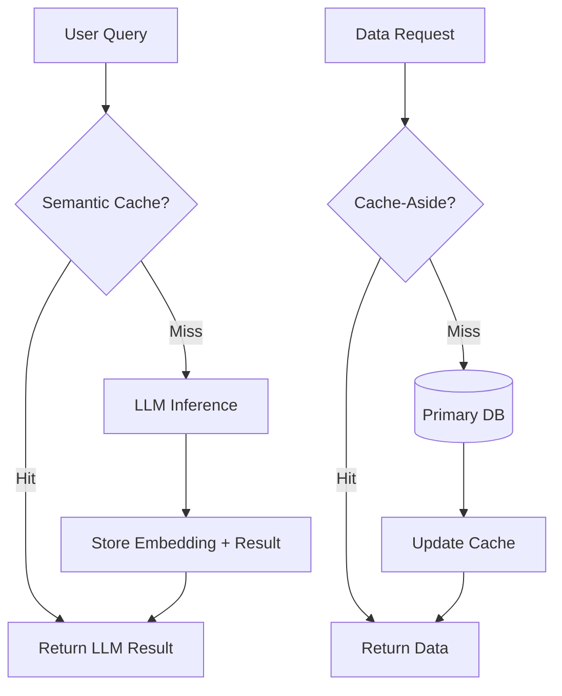

# Chapter 04: Caching Systems

> [!TIP] TL;DR
> - Why semantic caching for LLMs bypasses 90% of expensive token generation costs.
> - Preventing the "Thundering Herd" with request coalescing and probabilistic early expiration.
> - When to use Cache-Aside vs. Write-Through based on consistency requirements.
> - Scaling global caches with multi-region Redis clusters and edge replication.

## What this is
Caching is the temporary storage of frequently accessed data in a high-speed memory layer to reduce latency and protect the primary data store from redundant load. In 2026, caching has evolved beyond simple key-value lookups of database rows. The most significant shift is the rise of **Semantic Caching**. Unlike traditional caches that require an exact string match (e.g., `GET user:123`), semantic caches for AI applications hash the high-dimensional embedding vector of a query. This allows the system to recognize that "What is the capital of France?" and "Which city is the French capital?" are semantically identical, returning the same cached LLM response and saving thousands of dollars in redundant inference costs.

Physically, caches like Redis and Memcached operate almost entirely in RAM, providing sub-millisecond access times. However, managing a distributed cache introduces "cache coherence" problems: ensuring that when data changes in the database, the cache is updated or invalidated instantly to prevent serving stale information. In modern high-throughput systems, we also must design against the **Cache Stampede** (or Thundering Herd), where a single cache key expiration triggers thousands of simultaneous requests to the database, potentially crashing it. Solving this requires advanced patterns like request coalescing at the service layer or using probabilistic algorithms to refresh the cache before it actually expires.

## Architecture diagram

<!-- source: research brief, section 3, Topic: Caching -->

## Core trade-offs

| When to use this | When NOT to use this | Trade-off you accept |
|---|---|---|
| Read-heavy workloads (90%+) | Data that changes every second | Added complexity of invalidation logic |
| Reducing LLM inference costs | One-time, unique analytics queries | Memory cost of storing redundant state |
| Protecting legacy databases | Low-latency transactional writes | Risk of serving stale/inconsistent data |

## At scale: how real companies do it
**Meta** (Facebook) operates one of the world's largest caching infrastructures, serving over 10 billion queries per second. Their architecture, known as **TAO** (The Associations and Objects), acts as a geographically distributed graph cache that persists to MySQL. TAO handles the massive complexity of social relationships by acting as a write-through cache: when you "Like" a post, TAO updates the cache and the database simultaneously, ensuring that your friends see the update instantly regardless of their global region. This demonstrates that at trillion-scale, the cache is the primary point of interaction, while the database acts as the archival source of truth.
<!-- source: research brief, section 4, Case Study 11 -->

## Back-of-envelope
- **Latency**: Main Memory Reference: 100 ns <!-- source: research brief, section 5 -->
- **Latency**: L1 Cache Reference: 0.5 - 1 ns <!-- source: research brief, section 5 -->
- **Efficiency**: Semantic Caching can reduce LLM costs by: 40% - 90% (workload dependent) <!-- source: research brief, section 3 -->

## Failure modes

| Symptom you see | Root cause | Specific fix |
|---|---|---|
| Cache Stampede | Concurrent misses on a hot key overload the DB | Use request coalescing (locking) or early probabilistic refresh |
| Dirty Reads | Data updated in DB but not invalidated in cache | Use Write-Through pattern or shorter TTLs (Time To Live) |
| Performance Floor | Cache memory fragmentation or eviction overhead | Distribute data using consistent hashing across a Redis cluster |

## Interview angle
1. **Design a distributed cache for a global news platform.**
   *Framework Answer*: Clarify the read/write ratio (likely 99:1). Propose a multi-level caching strategy: CDN at the edge for static assets, and a Redis cluster for dynamic article content. Explain the "Cache-Aside" pattern and how you handle cache invalidation through an event-driven mechanism (e.g., a DB trigger sending a mensaje to an invalidation worker).

2. **How do you save costs on a chatbot that answers 1M questions per day?**
   *Framework Answer*: Propose **Semantic Caching**. Explain how you embed the user's question and search a vector cache for sub-1ms similarity matches. If a match is found above a certain threshold, return the cached answer. This bypasses the $3.00/1M token cost of a model like Claude 3.5 Sonnet for repeat questions.

## Further reading
- **[Redis Semantic Cache Design Patterns](https://pricepertoken.com/)** — Technical Overview. How to use vector indexing inside Redis to bypass LLM inference.
- **[TAO: Facebook’s Distributed Data Store](https://dibishks.medium.com/how-facebooks-social-graph-handles-10-billion-queries-every-second-586c2d6edece)** — Primary Paper. The gold standard for global, write-through graph caching.
- **[Surviving the Thundering Herd](https://shopify.engineering/surviving-flashes-of-high-write-traffic-using-scriptable-load-balancers-part-ii)** — Shopify Engineering. Practical techniques for protecting your database during traffic spikes.

## What to read next
- [03-databases.md](./03-databases.md) — Understanding the data layer your cache protects.
- [07-llm-infrastructure.md](../ai-era/07-llm-infrastructure.md) — Dive deeper into the KV cache inside GPUs.
