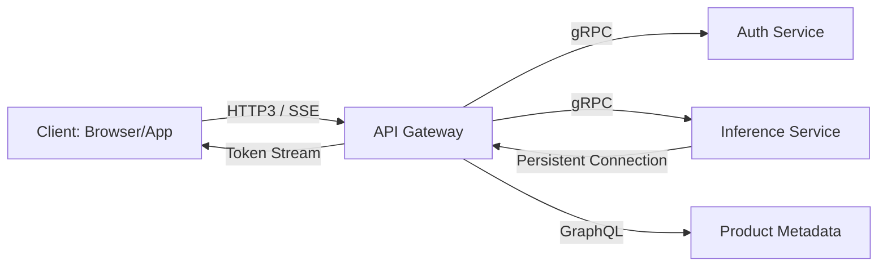

# Chapter 05: Networking & APIs

> [!TIP] TL;DR
> - Why HTTP/3 (QUIC) is the 2026 standard for reducing latency in lossy mobile networks.
> - When to use Server-Sent Events (SSE) over WebSockets for efficient LLM token streaming.
> - Choosing between the rigid speed of gRPC and the flexible introspection of GraphQL.
> - Implementing robust rate limiting using Token Buckets to protect non-deterministic AI endpoints.

## What this is
Networking is the connective tissue of distributed systems. In 2026, the focus has shifted from merely "connecting services" to **latency minimization**. The massive adoption of HTTP/3—built on the QUIC protocol—has resolved the "Head-of-Line Blocking" problem inherent in TCP. By using UDP with built-in encryption and congestion control, HTTP/3 allows mobile users on unstable networks to maintain high-speed connections even when individual packets are lost, which is critical for the persistent sessions required by AI agents and streaming interfaces.

API design has also specialized to handle modern workloads. While REST remain the default for simple CRUD, enterprise architectures now leverage **gRPC** for high-performance, internal service-to-service communication due to its extremely efficient Protobuf serialization. For frontends that need to query complex, nested data (like a social graph or a block-based editor), **GraphQL** provides a unified schema that prevents over-fetching. Most importantly, the "Streaming Era" of Generative AI has made **Server-Sent Events (SSE)** the preferred protocol for unidirectional token flows; it is lighter than WebSockets and works natively over standard HTTP, allowing engineers to stream LLM responses to users with minimal overhead.

## Architecture diagram

<!-- source: research brief, section 3, Topic: API Design -->

## Core trade-offs

| When to use this | When NOT to use this | Trade-off you accept |
|---|---|---|
| Unidirectional LLM streaming (SSE) | Bi-directional real-time chat | Lack of binary data support (text only) |
| Internal microservice speed (gRPC) | Public-facing third-party APIs | Requirement for Protobuf shared schemas |
| Complex, nested data (GraphQL) | Simple, single-resource updates | High computational cost of query parsing |

## At scale: how real companies do it
**Stripe** and **Shopify** utilize advanced L7 (Application Layer) routing and rate limiting to protect their core transactional databases. During high-traffic events, Shopify uses scriptable load balancers (Nginx with Lua) to implement **Token Bucket** rate limiting at the edge. By moving this logic away from the application servers and closer to the user, they can reject malicious or excessive requests in mere microseconds, ensuring that "Flash Sale" traffic never overwhelms the underlying checkout infrastructure.
<!-- source: research brief, section 4, Case Study 12 -->

## Back-of-envelope
- **Latency**: Same-AZ Datacenter Round Trip: 0.2 - 1.0 ms <!-- source: research brief, section 5 -->
- **Efficiency**: gRPC/Protobuf vs. REST/JSON: ~30-50% smaller payload size <!-- source: research brief, section 3 -->
- **Reliability**: QUIC (HTTP/3) connection migration: < 1ms switch during IP change <!-- source: research brief, section 3 -->

## Failure modes

| Symptom you see | Root cause | Specific fix |
|---|---|---|
| Head-of-Line Blocking | TCP packet loss stalls the entire stream | Migrate to HTTP/3 (QUIC) for independent stream multiplexing |
| 429 "Too Many Requests" | Thundering herd of retries after a service hiccup | Implement exponential backoff with jitter on the client side |
| Stale Schema Conflicts | Internal services using mismatched Protobuf versions | Use strict schema versioning and backward-compatible field additions |

## Interview angle
1. **Design an API for a real-time stock trading application.**
   *Framework Answer*: Clarify the frequency of updates. Propose **gRPC streaming** or **WebSockets** for the price feed to ensure low-latency, bi-directional communication. Use REST or GraphQL for historical lookups. Explain how you use HTTP/3's QUIC protocol to handle users switching between Wi-Fi and 5G without dropping their active trading session.

2. **How would you protect an AI API that is expensive to run ($1.00/request)?**
   *Framework Answer*: Implement a tiered rate limiting strategy using the **Token Bucket** algorithm. Use the user's API key to assign different quotas. Combine this with a scriptable edge load balancer to drop "unauthenticated" or "bursty" traffic before it ever hits the expensive GPU nodes. Mention semantic caching as a way to avoid the cost entirely for repeat queries.

## Further reading
- **[Envoy Proxy: Modern L7 Routing](https://www.envoyproxy.io/docs)** — The industry standard service mesh for gRPC and HTTP/3.
- **[Shopify: Surviving the Flash Sale](https://shopify.engineering/surviving-flashes-of-high-write-traffic-using-scriptable-load-balancers-part-i)** — Engineering Blog. How to move API logic to the load balancing tier.
- **[gRPC vs. GraphQL: Real-world Tradeoffs](https://isheir.medium.com/grpc-vs-graphql-real-world-tradeoffs-7d8b5c9b4e7b)** — ByteByteGo Analysis. When to prioritize speed over flexibility.

## What to read next
- [13-streaming-realtime.md](../modern/13-streaming-realtime.md) — How APIs move data into real-time event streams.
- [09-agent-architecture.md](../ai-era/09-agent-architecture.md) — Designing APIs that AI agents can consume reliably.
