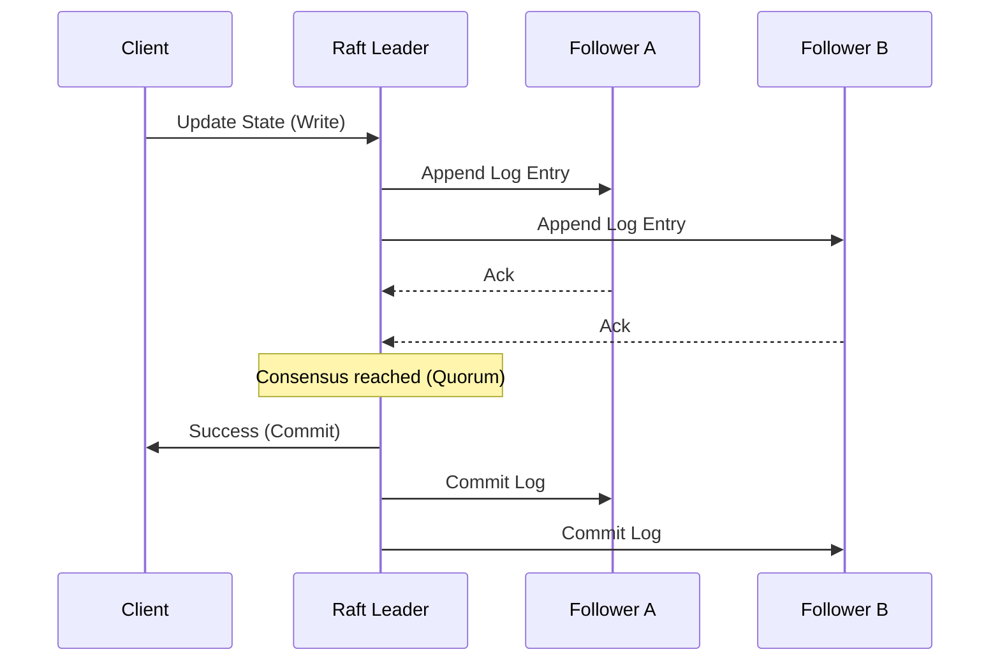

# Chapter 06: Distributed Systems

> [!TIP] TL;DR
> - Why the PACELC theorem is more relevant for production latency tuning than the CAP theorem.
> - Using the Raft consensus algorithm to maintain a consistent state across global clusters.
> - Preventing data loss with the Saga pattern and the Transactional Outbox.
> - How consistent hashing with virtual nodes ensures even load distribution during node failure.

## What this is
A distributed system consists of multiple independent components that appear to its users as a single coherent system. The fundamental challenge of distributed systems is **synchronization over an unreliable network**. In 2026, we lean on the **PACELC theorem**, an extension of CAP. CAP states that in the event of a network Partition (P), you must choose between Availability (A) and Consistency (C). PACELC adds that even when there is no partition (E—Else), you must choose between Latency (L) and Consistency (C). Most modern high-growth systems choose Latency (L) and Availability (A) for user-facing features while reserving strict Consistency (C) for financial and stateful core operations.

To manage consistency without manually locking every database row, architects use consensus algorithms like **Raft**. Raft ensures that a cluster of nodes can agree on a series of state changes (a log) even if some nodes fail. For longer-running business processes that span multiple microservices (e.g., "Booking a Trip" involving flights, hotels, and payments), we use the **Saga Pattern**. Instead of a single massive distributed transaction which is slow and prone to failure, a Saga breaks the process into a series of local transactions. Each step has a corresponding "compensating transaction" that reverses the work if a later step fails, ensuring eventual consistency without the bottleneck of global locks.

## Architecture diagram

<!-- source: research brief, section 3, Topic: CAP Theorem -->

## Core trade-offs

| When to use this (Strict Consistency) | When NOT to use this | Trade-off you accept |
|---|---|---|
| Financial transactions / Metadata | Social media "Likes" / Analytics | Significant increase in write latency |
| Small, mission-critical clusters | Massive, globally distributed frontends | Risk of system downtime if quorum is lost |
| Coherent state management (Raft) | High-throughput logging | Complexity of leader election logic |

## At scale: how real companies do it
**Uber** handles millions of simultaneous rides and payments using a distributed architecture that prioritizes availability. To manage the state of a "Trip" across multiple services, they utilize the **Saga Pattern**. If a driver is matched but the payment fails, the Saga triggers a compensating action to un-match the driver and notify the user. By avoiding synchronous distributed locks (which would crash under Uber's global scale), they ensure that the marketplace remains fluid even when individual services experience transient failures.
<!-- source: research brief, section 3, Topic: Distributed Transactions -->

## Back-of-envelope
- **Consensus**: Typical Raft quorum write latency (Same Region): 1-5ms <!-- source: research brief, section 5 -->
- **Availability**: "Five Nines" (99.999%): ~5.26 minutes of downtime per year <!-- source: research brief, section 3 -->
- **Scale**: Consistent hashing with 200 virtual nodes: <1% load variance between nodes <!-- source: research brief, section 3 -->

## Failure modes

| Symptom you see | Root cause | Specific fix |
|---|---|---|
| Split Brain | Two nodes believe they are the leader after a partition | Use a consensus algorithm (Raft) that requires a majority quorum |
| Partial Completion | A business process fails mid-way, leaving inconsistent state | Implement the Saga pattern with compensating transactions |
| Thundering Herd | Multiple nodes attempt leader election simultaneously | Use randomized election timeouts to reduce contention |

## Interview angle
1. **Design a distributed locking service (like ZooKeeper).**
   *Framework Answer*: Clarify the consistency requirement (must be strict). Propose a leader-based architecture using the **Raft** consensus algorithm. Explain how clients acquire a "lease" on a lock and how the leader heartbeats ensure the lock is released if a client crashes. Deep dive into the "Fencing Token" to prevent a client with a stale lock from overwriting data.

2. **How do you handle a transaction that spans three different microservices?**
   *Framework Answer*: Avoid Two-Phase Commit (2PC) due to its lack of scalability. Propose the **Saga Pattern** (specifically the Orchestration-based Saga). Explain how a central coordinator manages the steps and how you use the **Transactional Outbox** pattern to ensure that the message to the next service is only sent if the local DB transaction succeeds.

## Further reading
- **[The Raft Consensus Algorithm](https://raft.github.io/)** — Interactive Documentation. Why Raft is easier to understand and implement than Paxos.
- **[Sagas: Distributed Transactions for Microservices](https://microservices.io/patterns/data/saga.html)** — Chris Richardson. The definitive guide to managing state without distributed locks.
- **[CAP vs. PACELC: Tuning Your Latency](https://cloud.google.com/blog/products/databases/spanner-in-2025)** — Technical Analysis. Why the CAP theorem is no longer enough for modern architects.

## What to read next
- [02-reliability.md](./02-reliability.md) — How distributed patterns contribute to overall system reliability.
- [03-databases.md](./03-databases.md) — How NewSQL databases like Spanner implement these distributed foundations.
