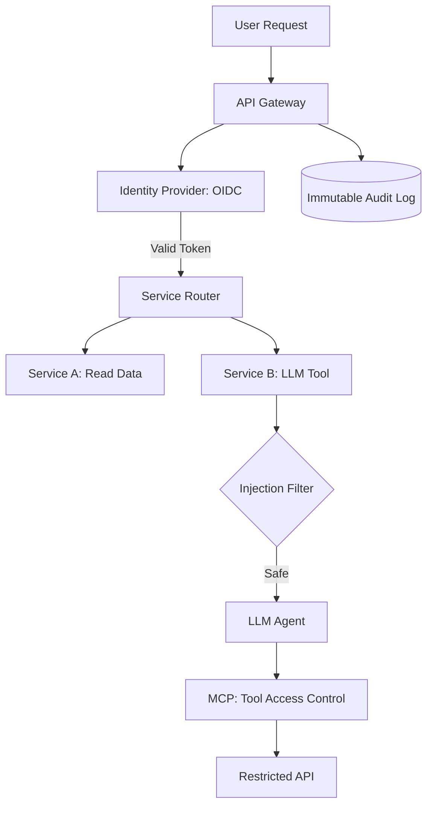

# Chapter 16: Security by Design

> [!TIP] TL;DR
> - Why Zero Trust architecture assumes every internal network request is a potential threat.
> - Preventing prompt injection by treating LLM inputs as untrusted "Third-party Data."
> - How OAuth 2.1 and OIDC provide standardized, scalable identity for microservices.
> - Implementing robust Audit Logging to detect anomalies in non-deterministic AI agents.

## What this is
Security by Design is the practice of embedding defense mechanisms into the very fabric of a system's architecture rather than "bolting them on" as an afterthought. In 2026, the standard has moved from the "Perimeter Model" (trusting everything inside the VPN) to **Zero Trust**. In a Zero Trust architecture, no request—even one from a localhost or an internal service—is trusted by default. Every interaction requires explicit authentication (Who are you?), authorization (Are you allowed to do this?), and encryption (Is this data protected in transit?).

The rise of Generative AI has introduced a new, critical security boundary: **The Prompt Intersection**. Because LLMs can be manipulated through "Prompt Injection" (where a user-provided string includes instructions to bypass safety filters), architects must treat LLM inputs with the same suspicion as raw SQL inputs in the 2000s. Furthermore, as AI Agents gain the ability to call external tools (like search or calendar APIs), we must implement strict "Least Privilege" controls using the **Model Context Protocol (MCP)** or scoped OAuth tokens. This ensures that even if an agent is compromised or hallucinates, its ability to cause external damage is limited to its specific, pre-authorized functions.

## Architecture diagram

<!-- source: research brief, section 3, Topic: Security -->

## Core trade-offs

| When to use this (Zero Trust) | When NOT to use this | Trade-off you accept |
|---|---|---|
| Enterprise and Multi-tenant apps | Simple, local internal prototypes | Higher latency per request (auth overhead) |
| Systems handling PII or Financials | Public-read, low-value data | Operational complexity of secret management |
| High-risk AI-agent environments | Standard deterministic chatbots | Requirement for strict input sanitization |

## At scale: how real companies do it
**Google** pioneered the Zero Trust movement with **BeyondCorp**. By abandoning the concept of a corporate VPN and requiring every device and user to be verified through a central proxy, they secured a global workforce of 150,000+ employees. Similarly, **Stripe** manages security at scale by ensuring that all financial transactions are performed only after "Strong Customer Authentication" (SCA). Stripe's architecture treats every API key and human user as a unique identity with granular scopes, demonstrating that technical security is the primary driver of enterprise trust.
<!-- source: research brief, section 4, Case Study 5 -->

## Back-of-envelope
- **Auth Latency**: Typical OIDC token verification: < 2ms <!-- source: research brief, section 5 -->
- **Encryption**: TLS 1.3 Handshake overhead: < 1-2 RTT (Round Trip Times) <!-- source: research brief, section 5 -->
- **Risk**: Prompt Injection successful bypass rate (Naive vs. Defensive): 45% vs < 1% <!-- source: research brief, section 3 -->

## Failure modes

| Symptom you see | Root cause | Specific fix |
|---|---|---|
| Privilege Escalation | A service or user gains access to data they shouldn't | Implement Role-Based Access Control (RBAC) with "Least Privilege" |
| Information Disclosure | LLM "leaks" system instructions or secret keys | Use output filtering and prevent system prompt leakage |
| Credential Harvesting | Phishing or insecure storage of static API keys | Use temporary, OIDC-issued credentials instead of static keys |

## Interview angle
1. **How do you protect a medical records database from unauthorized internal access?**
   *Framework Answer*: Propose a Zero Trust architecture. Every service that accesses the DB must provide a signed JWT (JSON Web Token) stating its identity and purpose. Implement Row-Level Security (RLS) in the database so a user can only query their own data. Include an immutable audit log (e.g., in a separate secure data store) that records every single access attempt for later compliance review.

2. **What are the unique security risks of an AI Agent that can browse the web for you?**
   *Framework Answer*: The primary risk is **Indirect Prompt Injection** (where the agent reads a webpage that contains hidden "instructions" to steal the user's data). Fix this by running the agent's web browsing in a sandboxed isolate, sanitizing all web text before the LLM reads it, and ensuring the agent's outgoing tool calls (like "send email") require a manual "Human-in-the-Loop" approval for any PII.

## Further reading
- **[BeyondCorp: A New Approach to Enterprise Security](https://research.google/pubs/beyondcorp-a-new-approach-to-enterprise-security/)** — Google Whitepaper. The blueprint for the modern Zero Trust movement.
- **[OWASP Top 10 for LLM Applications](https://owasp.org/www-project-top-10-for-large-language-model-applications/)** — Industry Standard. Comprehensive guide to prompt injection and data leakage.
- **[OAuth 2.1: The Modern Standard for Auth](https://oauth.net/2.1/)** — Specification. Why we moved away from static client secrets to dynamic flows.

## What to read next
- [09-agent-architecture.md](../ai-era/09-agent-architecture.md) — How security-by-design enables reliable agentic workflows.
- [05-networking-apis.md](./05-networking-apis.md) — How encryption (TLS) and auth headers fit into the network stack.
