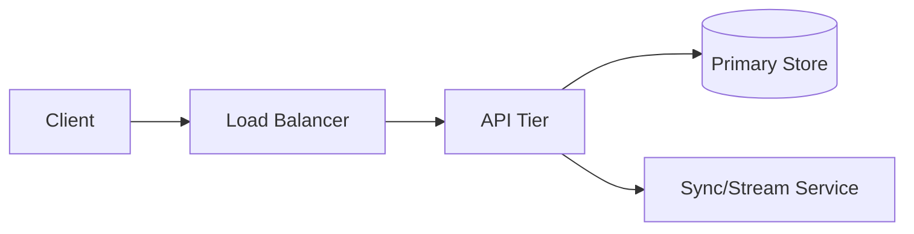

# System Design Interview Framework (45-Min Structure)

The goal of a system design interview is not to provide a "perfect" answer, but to demonstrate your ability to navigate trade-offs under ambiguity. Use this 4-step framework to manage your 45-minute whiteboard session.

---

## 1. Clarification & Requirement Gathering (5–7 Minutes)
*Never start drawing before you know exactly what the system needs to do.*

- **Functional Requirements**: What are the top 3 actions the user must be able to take? (e.g., "Post a message," "Filter by topic," "Stream results.")
- **Non-functional Requirements**: High availability vs. strict consistency (CAP). Latency targets (e.g., p99 < 200ms).
- **Security & Multi-tenancy**: Is data isolation a priority? Who are the users (internal vs. external)?
- **Scale**: What is the DAU (Daily Active Users)? What is the anticipated growth?

## 2. Back-of-the-Envelope Estimation (5–7 Minutes)
*Use the 2026 hardware numbers to prove your architecture can handle the load.*

- **Storage**: Calculate total data over 5 years. (e.g., "100M tokens/day * 4 bytes/token = 400MB/day.")
- **Throughput**: Convert DAU to Requests Per Second (RPS). (e.g., "1M DAU -> 12 RPS average, 120 RPS peak.")
- **GPU/Memory**: For AI systems, calculate KV cache size. (e.g., "Batch 128 * 2k context ≈ 40GB VRAM.")

## 3. High-Level Design (10–15 Minutes)
*Draw the boxes and arrows. Focus on the data flow.*

- **The Flow**: Client → Load Balancer → Web Tier → Database/Cache.
- **The Protocol**: Are you using REST, gRPC, or SSE? Justify the choice based on latency.
- **Data Partitioning**: How will you shard the database or index?
- **Mermaid Template**:

## 4. Deep Dive & Trade-offs (15 Minutes)
*This is where senior-level candidates shine. Identify the "one hard problem."*

- **The Bottleneck**: Why will this system fail? (e.g., "The Redis cache will become a hotspot during the viral event.")
- **The Resolution**: Propose a fix. (e.g., "We will implement virtual nodes and client-side consistent hashing.")
- **AI-Specific Dives**:
  - vLLM PagedAttention for memory.
  - Hybrid search for RAG accuracy.
  - MCP for agent reliability.

---

### Pro-Tips for 2026
- **Numbers Beat Adjectives**: Say "8ms latency" not "very fast."
- **Mention the Edge**: Use Cloudflare Workers or Wasm isolates for latency-sensitive logic.
- **Be Honest**: If you don't know a specific DB internal, focus on the CAP theorem trade-off you are accepting by choosing that category of DB.
