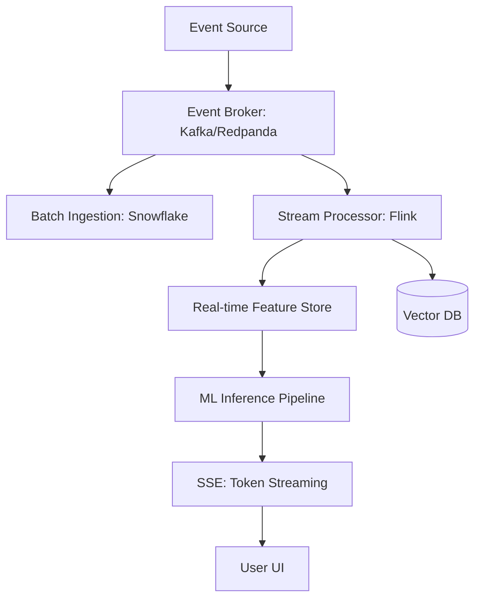

# Chapter 13: Streaming & Real-time Systems

> [!TIP] TL;DR
> - Why NVMe storage has shifted event broker performance from disk-bound to CPU-bound.
> - How real-time feature stores bridge the gap between event streams and ML inference.
> - When to use Server-Sent Events (SSE) versus WebSockets for streaming LLM tokens.
> - Handling late-arriving events with Apache Flink watermarks and exactly-once semantics.

## What this is
Streaming systems manage data as a continuous flow of events rather than discrete, static batches. In the classic Web 2.0 era, "real-time" often meant 24-hour Hadoop lag or, at best, a 15-minute Kafka buffer. In 2026, real-time means **sub-second propagation** from ingestion to inference. This acceleration is driven by the physical shift to NVMe storage, where event brokers like Kafka or Redpanda can now perform disk writes (`fsync`) in under 1ms. This has effectively transferred the architectural bottleneck to the CPU and the network stack, requiring a rethink of how we process events at scale.

Modern streaming architectures also power the "AI Feedback Loop." As users interact with an application, their actions are streamed into a **Real-time Feature Store**. This store continuously aggregates raw events into mathematical features (e.g., "user_clicks_last_10_minutes") that are immediately available for machine learning models to make personalized predictions. Furthermore, the rise of Generative AI has made Server-Sent Events (SSE) a mandatory architectural component; because users expect to see LLM tokens as they are generated, backends must stream data chunk-by-chunk over persistent HTTP connections rather than waiting for a complete JSON response.

## Architecture diagram

<!-- source: research brief, section 2, Gap 7 -->

## Core trade-offs

| When to use this (Streaming) | When NOT to use this | Trade-off you accept |
|---|---|---|
| Real-time analytics and dashboards | Reporting on 3-year historical trends | Higher operational cost and complexity |
| Prompt, personalized AI inference | Simple daily summary emails | The challenge of "exactly-once" processing |
| High-throughput event processing | Low-volume transactional CRUD | Significant engineering overhead for state management |

## At scale: how real companies do it
**Stripe** completely rearchitected their financial reporting system to move from 24-hour batch processing to real-time event streams. By upgrading their data aggregation engine, they allowed customers to query complex, mutable financial metrics (like Monthly Recurring Revenue) with a maximum latency of 15 minutes. This required a robust streaming analytics framework that could handle billions of financial events while maintaining strict transactional accuracy, illustrating the industry-wide transition from "Hadoop-style" lag to modern "Flink-style" immediacy.
<!-- source: research brief, section 4, Case Study 5 -->

## Back-of-envelope
- **Processing Scale**: Modern Kafka Cluster Throughput: 10M+ events/sec <!-- source: research brief, section 2 -->
- **Storage Latency**: NVMe fsync Write: 0.05ms - 1.00ms <!-- source: research brief, section 5 -->
- **Network Latency**: SSE Time To First Token (TTFT): < 100ms <!-- source: research brief, section 2 -->

## Failure modes

| Symptom you see | Root cause | Specific fix |
|---|---|---|
| Growing Consumer Lag | Processor cannot keep up with ingestion rate | Scale the stream processor horizontally using consumer groups |
| Duplicate Event Processing | Network retry during a "zombie" consumer failure | Implement idempotent processing or "Exactly-Once" semantics (EOS) |
| Stale Features in ML | Feature store write latency exceeds inference path | Move feature computation to the edge or use a faster in-memory store |

## Interview angle
1. **Design a real-time leaderboard for a global game with 1M concurrent players.**
   *Framework Answer*: Clarify the frequency of updates. Propose an event-driven architecture where player scores are streamed into a Kafka topic. Use an in-memory stream processor (like Flink or Redis) to maintain the sorted sets for the leaderboard. Explain how you use partitioning to scale the ranking logic across multiple sub-leaderboards.

2. **How do you stream LLM responses to 10k users simultaneously?**
   *Framework Answer*: Propose an architecture using Server-Sent Events (SSE) over HTTP/2 or HTTP/3 to avoid the overhead of full JSON buffering. Explain the need for an API gateway that supports persistent, long-lived connections. Deep dive into how you manage connection state and handle partial token generation failures without crashing the user session.

## Further reading
- **[Latency Numbers Every Streaming Engineer Should Know](https://dev.to/david_kjerrumgaard_d31d7e/latency-numbers-every-data-streaming-engineer-should-know-h91)** — 2026 Edition. Why hardware shifts are the primary driver of streaming design.
- **[Stripe: Real-time Analytics for Billing](https://stripe.com/blog/how-we-built-it-real-time-analytics-for-stripe-billing)** — Engineering Blog. Moving from batch to streams without breaking financial consistency.
- **[SSE vs WebSockets for AI Streaming](https://artificialanalysis.ai/leaderboards/models)** — Technical Comparison. Why SSE is the better choice for unidirectional token flows.

## What to read next
- [07-llm-infrastructure.md](../ai-era/07-llm-infrastructure.md) — How streaming fits into the token generation life-cycle.
- [14-edge-computing.md](./14-edge-computing.md) — Moving your stream processing mere milliseconds from the user.
