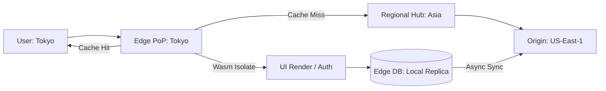

# Chapter 14: Edge Computing & Wasm Isolates

> [!TIP] TL;DR
> - Why WebAssembly (Wasm) isolates beat containers for ultra-low latency edge logic.
> - Moving state to the edge with globally distributed databases and scriptable KV stores.
> - When to route requests to the regional "Origin" versus executing at the "Edge PoP."
> - How edge orchestration minimizes Time To First Token (TTFT) for streaming LLM responses.

## What this is
Edge Computing is the paradigm of moving computational power and data storage as close to the user as possible—typically to Point of Presence (PoP) locations just milliseconds away from the end-device. In 2026, the engine of the edge is no longer the Docker container, but the **Wasm Isolate**. Unlike containers which require hundreds of megabytes of RAM and seconds to cold-start, Wasm isolates (like those in Cloudflare Workers or Fastly Compute) can start in under 5 milliseconds with mere kilobytes of memory overhead. This allows for "Function-as-a-Service" (FaaS) execution that feels instantaneous to the user.

Designing for the edge requires a "Stateless First" mindset. Because data takes time to travel, storing it in a central database in Virginia while the user is in Tokyo adds 200ms of unavoidable "speed-of-light" latency. Modern edge architectures solve this using **Edge-Native Databases** (like Cloudflare D1 or Turso) that replicate data across hundreds of global PoPs. This enables the "Regional Hub" model: users interact with the Edge PoP for low-latency tasks (like auth checks or UI rendering), and only "hit the origin" for heavy transactional or complex analytical workloads. For AI applications, the edge acts as the orchestration layer, managing the streaming of tokens from regional GPU clusters to ensure a responsive, jitter-free user experience.

## Architecture diagram

<!-- source: research brief, section 3, Topic: Edge Computing -->

## Core trade-offs

| When to use this | When NOT to use this | Trade-off you accept |
|---|---|---|
| User-facing UI and Auth | Batch processing or heavy ML training | Limited CPU and RAM per execution |
| Globally distributed user bases | Single-region internal apps | Complexity of data sync and staleness |
| Low-latency AI orchestration | Simple static websites | Higher cost per compute cycle vs VM |

## At scale: how real companies do it
**Cloudflare** and **Vercel** have democratized edge scaling through their global networks of 300+ PoPs. By utilizing Wasm isolates, these platforms allow companies like **TikTok** or **Shopify** to execute complex routing and experiments (A/B testing) at the edge without the user ever feeling a "redirect" lag. Specifically, during global shopping events, Shopify moves high-volume buy-button logic to the edge PoP, allowing them to reject bot traffic and queue users instantly, protecting the core commerce engine from massive, geographically diverse traffic surges.
<!-- source: research brief, section 4, Case Study 12 -->

## Back-of-envelope
- **Latency**: User to Edge PoP (Local): 5 - 20 ms <!-- source: research brief, section 5 -->
- **Latency**: User to Origin (Cross-Continental): 150 - 300 ms <!-- source: research brief, section 5 -->
- **Execution**: Wasm Isolate Cold Start: < 5 ms <!-- source: research brief, section 2 -->

## Failure modes

| Symptom you see | Root cause | Specific fix |
|---|---|---|
| Inconsistent Data | Edge DB replica is stale | Use "Read-Your-Writes" consistency or route critical reads to origin |
| "Function Failed" | Isolate exceeded strict CPU/Memory limits | Move heavy logic to a regional VM or optimize the Wasm binary |
| High Edge Costs | Logic is too compute-intensive for the PoP pricing model | Partition the system: do routing at edge, heavy work at origin |

## Interview angle
1. **Design a system to show personalized advertisements with < 50ms latency.**
   *Framework Answer*: Clarify the global scale. Propose an **Edge Computing** architecture. Store user profile snapshots in an **Edge KV store**. Use a Wasm isolate at the Edge PoP to fetch the segment ID and select the ad creative. This ensures the ad is chosen and rendered within the PoP, mere milliseconds from the user's browser, bypassing the expensive origin round-trip.

2. **When should you NOT use the edge?**
   *Framework Answer*: Avoid the edge for any task that requires heavy CPU (e.g., video transcoding), massive RAM (e.g., training an LLM), or strict ACID consistency across global regions (e.g., moving money between accounts). These tasks are better suited for regional "Origin" data centers where powerful VMs and dedicated database clusters can manage the heavy state more reliably.

## Further reading
- **[Cloudflare Workers: How Wasm Isolates Work](https://blog.cloudflare.com/how-workers-works/)** — Technical Deep Dive. Why V8 isolates are the future of the serverless cloud.
- **[Turso: SQLite for the Edge](https://turso.tech/blog/sqlite-at-the-edge)** — Engineering Blog. How to move small, relational databases mere milliseconds from users.
- **[Vercel: The Evolution of the Frontend Cloud](https://vercel.com/blog/how-vercel-infrastructure-works)** — Case Study. How the edge enables "Instant Loading" for modern web apps.

## What to read next
- [05-networking-apis.md](../foundations/05-networking-apis.md) — How HTTP/3 and QUIC enable high-performance edge communication.
- [15-platform-engineering.md](./15-platform-engineering.md) — How to manage the deployment of thousands of global edge functions.
