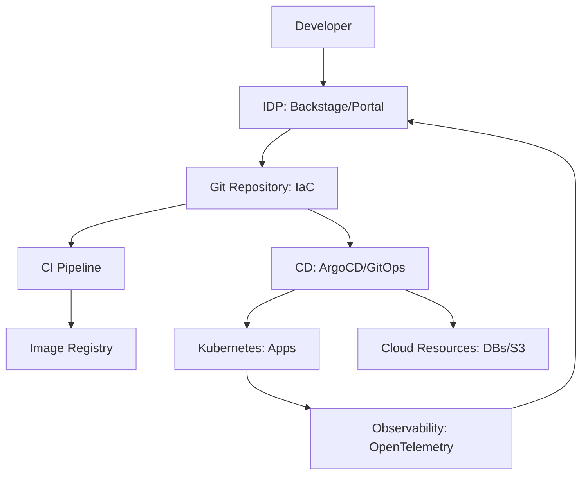

# Chapter 15: Platform Engineering & IDPs

> [!TIP] TL;DR
> - Why Platform Engineering is replacing DevOps by providing "Self-Service" infrastructure.
> - Using Internal Developer Portals (IDPs) like Backstage to reduce Cognitive Load.
> - The role of GitOps and "Infrastructure as Code" (IaC) in multi-region cloud scaling.
> - Measuring success with DORA metrics: Deployment Frequency, Lead Time, MTTR, and Change Failure Rate.

## What this is
Platform Engineering is the discipline of designing and building internal toolchains and workflows that enable self-service capabilities for software engineering organizations. In the previous DevOps era, the ideal was "You build it, you run it," which often overwhelmed developers with the complexity of Kubernetes, IAM roles, and cloud networking. In 2026, the focus has shifted to **reducing cognitive load**. A platform team builds an "Internal Developer Platform" (IDP) that abstracts away the underlying cloud complexity, allowing a developer to deploy a new microservice, provision a database, or set up a CI/CD pipeline through a single, standardized portal or CLI.

The core architectural pattern of modern platform engineering is **GitOps**. In a GitOps workflow, the "State of the World" is defined entirely in Git repositories. When a change is pushed to the repository, automated controllers (like ArgoCD or Flux) reconcile the actual running infrastructure with the desired state defined in the code. This ensures that infrastructure is versioned, auditable, and easily reproducible across different regions. For management, the effectiveness of the platform is measured not by "uptime," but by **DORA metrics**, which track how fast and reliably the organization can deliver value to customers.

## Architecture diagram

<!-- source: research brief, section 3, Topic: Platform Engineering -->

## Core trade-offs

| When to use this | When NOT to use this | Trade-off you accept |
|---|---|---|
| Scaling teams (>50 engineers) | Small, 2-person startups | High initial investment in platform staff |
| High compliance/security needs | Rapid prototyping of MVPs | Standardized "Golden Paths" limit local flexibility |
| Multi-cloud/Multi-region scale | Single-cloud monolithic apps | Maintenance of complex internal tooling |

## At scale: how real companies do it
**Spotify** created the blueprint for modern platform engineering with **Backstage**. Facing a proliferation of microservices that were becoming impossible to track, they built a central catalog where any engineer could find ownership, documentation, and a "Software Template" to spin up a new service in minutes. Today, thousands of companies use Backstage as their IDP, demonstrating that the "one-stop-shop" for infrastructure is the most effective way to maintain high developer velocity while ensuring that security and operational standards are met globally.
<!-- source: research brief, section 3, Topic: Platform Engineering -->

## Back-of-envelope
- **Velocity**: Lead Time for a new service (Manual vs. IDP): 1 week vs. 15 minutes <!-- source: research brief, section 3 -->
- **Reliability**: Change Failure Rate for Global Elite (DORA): < 5% <!-- source: research brief, section 3 -->
- **Scale**: Managed Kubernetes (EKS/GKE) cluster limit: 5,000+ nodes per cluster <!-- source: research brief, section 3 -->

## Failure modes

| Symptom you see | Root cause | Specific fix |
|---|---|---|
| "The Golden Cage" | Platform is too restrictive for specialized needs | Provide "escape hatches" or allow for custom module contributions |
| Configuration Drift | High manual edits in the cloud console bypass Git | Enforce strict GitOps reconciliation and disable manual write access |
| High Cognitive Load | The IDP is just as complex as the underlying tools | Focus on UX research and simplify the developer-facing abstractions |

## Interview angle
1. **How do you reduce the "Mean Time To Recovery" (MTTR) for a global application?**
   *Framework Answer*: Propose a combination of automated observability and GitOps. Use OpenTelemetry to detect anomalies and trigger automated rollbacks via the CD controller if error rates spike after a deployment. Ensure that the "Last Known Good" state is always a single git-revert away. Explain how standardizing headers and logs through the platform makes debugging cross-service issues 10x faster for developers.

2. **Why would a company invest in a platform team instead of just having everyone use AWS?**
   *Framework Answer*: To ensure **Security, Compliance, and Velocity**. A platform team creates "Golden Paths"—pre-approved infrastructure templates that have security best practices (like encryption and VPC peering) built-in. This allows developers to focus on writing product code rather than worrying about the 200 different security settings in the AWS console, ultimately increasing the company's "Deployment Frequency."

## Further reading
- **[Team Topologies: Organizing for Flow](https://teamtopologies.com/)** — Matthew Skelton. The definitive book on how to structure platform and stream-aligned teams.
- **[Backstage: The Open Platform for IDPs](https://backstage.io/)** — CNCF Project. The industry-standard tool for building developer portals.
- **[DORA Metrics: 2024 State of DevOps Report](https://dora.dev/publications/state-of-devops-report/)** — Google Cloud Research. The benchmarks for elite-performing engineering organizations.

## What to read next
- [01-scalability.md](../foundations/01-scalability.md) — How the platform enables horizontal scaling without developer manual labor.
- [16-security-by-design.md](../foundations/16-security-by-design.md) — Embedding security into the platform's "Golden Paths."
